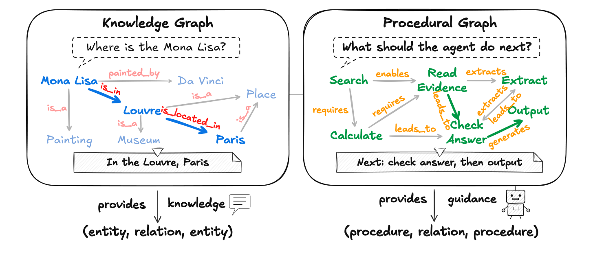
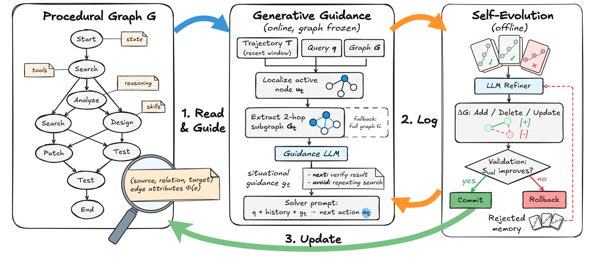
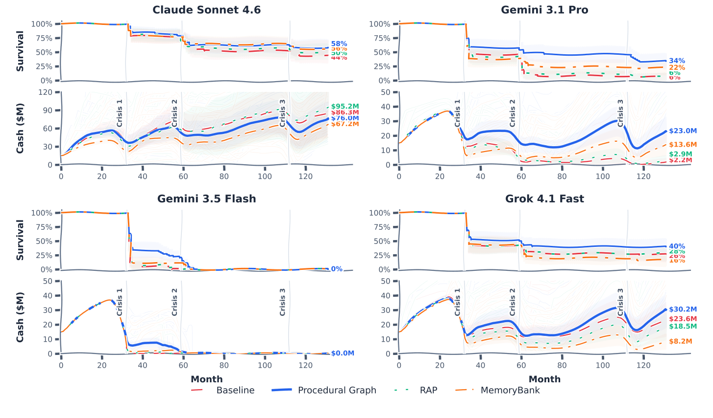
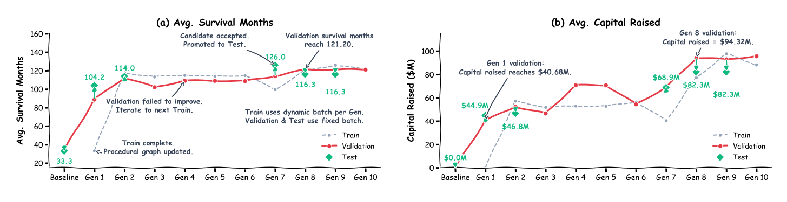
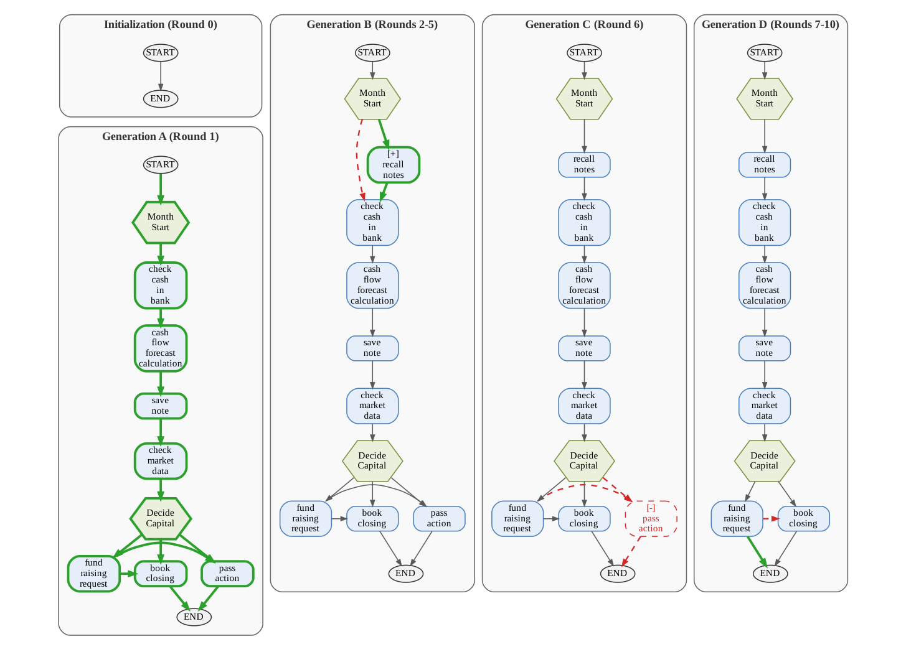
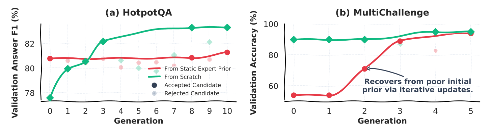

# Graphes Procéduraux : Structures d'Exécution Auto-Évolutives pour Agents LLM
*(Titre original : Procedural Graphs: Self-Evolving Execution Structures for LLM Agents)*

**Auteurs :**  
Yuxing Lu<sup>1,2,3</sup>, Yicheng Chen<sup>1</sup>, Shanchan Wu<sup>1</sup>, Sercan Ö. Arık<sup>1</sup>  
<sup>1</sup>Google, <sup>2</sup>Georgia Institute of Technology, <sup>3</sup>Peking University  
*Auteur correspondant :* `soarik@google.com`  
*Référence :* arXiv:2609.09153v1 [cs.AI] – 8 septembre 2026

---

## Guide Pédagogique et Traduction Intégrale de Référence

> [!NOTE]  
> **Note de lecture pédagogique :** Ce document propose la traduction intégrale et rigoureuse en français de l'article de recherche de Google, enrichie d'explications pédagogiques **immédiatement intégrées au fil du texte (inline)**. Chaque notion mathématique, acronyme technique et choix d'architecture fait l'objet d'un décryptage pas-à-pas accessible dès le niveau débutant.

---

## Résumé (Abstract)

Les grands modèles de langage sont de plus en plus déployés en tant qu'agents capables de planifier sur de longs horizons temporels et d'agir via des outils externes. La plupart des agents sélectionnent leurs actions par génération libre conditionnée sur un historique cumulatif, ce qui laisse implicite la connaissance procédurale relative à ce qu'il faut faire, dans quel ordre et sous quelles conditions.

> [!TIP]
> ### 🔍 Décryptage d'Acronyme : LLM (Large Language Model)
> **LLM** signifie *Large Language Model* (Grand Modèle de Langage en français). Il désigne des réseaux de neurones profonds (comme GPT-4, Claude, Gemini) entraînés sur des quantités massives de texte pour prédire les mots suivants. Dans le contexte de cet article, un LLM n'est pas seulement utilisé comme un générateur de texte passif, mais comme un **agent autonome** : il perçoit un environnement, réfléchit, et choisit des actions concrètes (appeler une fonction, exécuter du code, faire une recherche web).

À mesure que les trajectoires s'allongent, les agents peuvent perdre le fil de leurs objectifs, appeler des outils dans un ordre incorrect et répéter des actions improductives. 

Nous introduisons le **Graphe Procédural** (*Procedural Graph* ou **PG**) : tout comme un graphe de connaissances organise le savoir factuel en triplets `(entité, relation, entité)` pour répondre à des questions du type « *qu'est-ce que c'est ?* » (savoir déclaratif), un Graphe Procédural organise la connaissance procédurale en triplets `(procédure, relation, procédure)` pour répondre à des questions du type « *que faire ?* » (savoir opérationnel).

> [!NOTE]
> ### 💡 Point Pédagogique Débutant : Du Graphe de Connaissances au Graphe Procédural
> **L'analogie fondamentale :**
> - **Graphe de Connaissances classique :** Relie des faits statiques.  
>   *Exemple :* `(Mona Lisa, peinte_par, Léonard de Vinci)`. Cela répond à la question : *Qui a peint Mona Lisa ?*
> - **Graphe Procédural (PG) :** Relie des actions dynamiques avec des conditions.  
>   *Exemple :* `(Rechercher_Preuve, permet, Extraire_Information)`. Cela répond à la question : *Quelle étape dois-je exécuter ensuite pour résoudre mon problème ?*  
> Cette approche formalise les bonnes pratiques et les contraintes logiques sans obliger le modèle à tout réinventer mentalement à chaque instant.

À chaque étape de décision, le framework localise le nœud actif de l'agent, et un modèle de guidage traduit le sous-graphe environnant en un guidage contextuel à l'échelle de l'étape. Ce guidage oriente l'action suivante du solveur sans la lui dicter de manière rigide.

> [!IMPORTANT]
> ### 💡 Concept Clé : Guider sans Dicter (*Soft Guidance*)
> Contrairement aux systèmes automatisés rigides (comme les automates ou scripts stricts) qui forcent l'agent à exécuter une fonction codée en dur, le Graphe Procédural fournit un **guidage souple** (*soft guidance*). Il murmure à l'agent : *« Tu te trouves actuellement à l'étape A. Les étapes logiques suivantes sont B ou C. Attention, évite de faire D trop tôt. »* Le LLM solveur reste libre de son raisonnement et de la formulation de ses arguments, ce qui préserve sa flexibilité d'adaptation face aux imprévus.

Le graphe est **auto-évolutif** (*self-evolving*) : un raffineur LLM compare les trajectoires ayant échoué avec celles ayant réussi, modifie la topologie et les attributs du graphe, et valide les modifications qui préservent ou améliorent les performances sur un jeu de validation indépendant, tout en conservant en mémoire les modifications rejetées pour éviter de répéter les mêmes erreurs.

> [!TIP]
> ### 💡 Point Pédagogique : La Mémoire de Rejet (*Rejection Memory*)
> Lorsqu'un modèle essaye d'améliorer son propre mode d'emploi, il a tendance à proposer régulièrement les mêmes fausses bonnes idées. La **mémoire de rejet** agit comme un carnet noir : elle consigne les modifications de graphe qui ont conduit à des échecs lors des tests. Lorsqu'un nouveau cycle d'optimisation démarre, le modèle raffineur reçoit la liste de ces tentatives infructueuses comme contraintes négatives pour explorer de nouvelles voies d'amélioration.

En partant d'un squelette minimal, cette boucle d'apprentissage construit des graphes dont les performances égalent ou surpassent ceux conçus manuellement par des experts humains. Elle est également capable de réparer un a priori d'expert initialement défectueux.

Sur de multiples jeux de données, types de tâches et architectures de LLMs, le Graphe Procédural apporte des gains constants par rapport aux méthodes de référence basées sur la mémoire textuelle, et l'auto-évolution améliore encore les performances sans aucune ingénierie humaine supplémentaire.

---

## 1. Introduction

Les grands modèles de langage (LLMs) sont de plus en plus déployés en tant qu'agents autonomes qui élaborent des plans sur de longs horizons temporels et interagissent avec leur environnement par le biais d'outils externes (Qin et al., 2024 ; Sumers et al., 2023). 

> [!TIP]
> ### 🔍 Décryptage de Concept : Qu'est-ce qu'un « Agent Autonome » ?
> Un agent basé sur un LLM ne se contente pas de répondre à une invite (*prompt*). Il fonctionne selon une boucle continue :
> 1. **Perception :** Il reçoit une consigne initiale et observe l'état du monde.
> 2. **Raisonnement :** Il évalue la situation et formule une intention.
> 3. **Action :** Il appelle une fonction ou un outil externe (calculatrice, base de données, API web, interpréteur de code).
> 4. **Observation :** Il analyse le résultat renvoyé par l'outil et recommence jusqu'à résolution du problème.

La grande majorité des agents actuels prennent leurs décisions par génération libre non contrainte, conditionnée par un historique plat et cumulatif des actions et observations passées. 

> [!WARNING]
> ### 💡 Point Pédagogique Débutant : Le Piège de l'« Historique Plat » (*Flat Context*)
> **Comment fonctionnent les agents classiques :**  
> Toutes les pensées, actions et résultats précédents sont simplement accumulés sous forme d'une immense chaîne de texte :
> ```text
> [Tour 1] Pensée -> Action -> Observation
> [Tour 2] Pensée -> Action -> Observation
> ...
> [Tour 35] Pensée -> Action -> Observation -> ??? (Que faire maintenant ?)
> ```
> **Pourquoi cela pose problème :**  
> Ce journal grandissant fait peser l'intégralité de la cohérence procédurale sur la génération spontanée du LLM. L'agent doit à chaque étape relire un texte de plus en plus long, trier les observations encore pertinentes, déduire quelles étapes restent à accomplir, et choisir une action qui respecte l'ordre logique des dépendances.  
> Dès que les trajectoires s'allongent :
> - **Amnésie de l'objectif (*drift*) :** L'agent dévie de sa mission initiale.
> - **Inversion d'outils (*out-of-order*) :** Il tente de valider ou d'extraire un résultat avant d'avoir exécuté la recherche préalable.
> - **Boucles improductives (*infinite loops*) :** Il répète en boucle la même requête échouée en espérant un résultat différent.

### Les Limites des Approches Existantes

Pour remédier à cette dérive, les travaux antérieurs tentent d'apporter une structure procédurale à travers trois grandes familles :
1. **La mémoire textuelle et l'auto-réflexion** (Shinn et al., 2023 ; Zhao et al., 2024) : Elles consignent l'expérience passée sous forme de texte libre et la récupèrent pour la réinjecter dans le contexte. Cependant, bien que ces enregistrements conservent des leçons utiles, le solveur doit encore reconstruire par lui-même comment cette expérience générale s'applique à l'étape présente et quelles contraintes elle impose aux étapes suivantes.
2. **Les consignes conditionnées par l'état** (Fu et al., 2024) : Elles proposent des conseils plus ciblés (*« Si tu es dans la situation X, fais Y »*), mais récupèrent des règles isolées sans relier explicitement les étapes procédurales successives entre elles.
3. **Les flux de travail explicites (*workflows*) et machines à états finis** (Xiao et al., 2024 ; Zhang et al., 2023) : Ils formalisent explicitement chaque étape et verrouillent l'exécution. En contrepartie, ils exigent une conception humaine manuelle extrêmement lourde et rigide. La recherche automatisée de flux de travail (*automated workflow search*) allège cet effort manuel en optimisant la structure hors ligne (Zhang et al., 2025), mais le défi reste entier : comment combiner une **représentation procédurale modifiable** avec un **guidage dynamique conditionné par l'avancement en temps réel de l'agent** ?

---

### La Solution : Le Graphe Procédural (*Procedural Graph - PG*)

Nous soutenons qu'un agent autonome a besoin d'une connaissance procédurale :
- **Suffisamment structurée** pour l'éloigner des comportements invalides,
- **Suffisamment souple** pour préserver sa liberté de raisonnement,
- **Réactive** à sa progression effective en cours d'exécution,
- **Capable de s'améliorer** par l'expérience.

Nous répondons à ces exigences grâce au **Graphe Procédural (PG)**, un graphe orienté explicite et modifiable de connaissances procédurales.

Sa conception s'inspire directement d'une structure bien connue en intelligence artificielle, comme l'illustre la **Figure 1** ci-dessous :



*Figure 1 | Du savoir factuel à la procédure opérationnelle. À gauche : un Graphe de Connaissances classique organise les faits en triplets pour répondre aux questions « Qu'est-ce que c'est ? » (Mona Lisa -> peinte_par -> Léonard de Vinci). À droite : un Graphe Procédural organise les étapes d'une tâche en triplets pour répondre aux questions « Que doit faire l'agent ensuite ? » (Recherche -> permet -> Lecture de Preuve -> extrait -> Extraction -> mène_à -> Sortie).*

> [!NOTE]
> ### 💡 Décryptage de la Figure 1 : Comprendre les Composants d'un Graphe Procédural
> Observons la partie droite de la figure :
> - **Les Nœuds (sommets en vert) :** Ils représentent les étapes élémentaires : actions d'outils (`Search`, `Calculate`), étapes de raisonnement interne (`Check Answer`), ou états d'avancement (`Read Evidence`, `Extract`, `Output`).
> - **Les Arêtes (flèches orientées avec verbes) :** Elles encadrent les transitions légitimes (`enables`, `requires`, `leads_to`, `extracts`, `generates`).
> - **Le Résultat Opérationnel :** Au lieu d'extraire un fait statique, le graphe répond directement à l'interrogation de l'agent :  
>   *« Que dois-je faire ensuite ? »* $\rightarrow$ *« Prochaine étape : vérifier la réponse, puis générer la sortie. »*

Les nœuds du PG abstraient des actions d'outils, des compétences (*skills*), des étapes de raisonnement et des états ; ses arêtes encodent les transitions autorisées. Chaque arête est annotée d'attributs textuels décrivant **comment** et **quand** la transition doit être empruntée. 

Le Graphe Procédural maintient ainsi la connaissance procédurale d'un domaine **en dehors des poids du modèle de langage**. Cette externalisation offre trois avantages déterminants :
1. Elle peut être inspectée et auditée par des humains.
2. Elle peut être requêtée dynamiquement à chaque étape.
3. Elle peut être modifiée et enrichie sans nécessiter de réentraînement coûteux des poids neuronaux.

---

### Les Deux Temps du Framework : Inférence en Ligne et Évolution Hors Ligne

Notre framework met cette structure procédurale au travail selon deux phases parfaitement complémentaires :

1. **Pendant l'Inférence en Ligne (Temps Réel) :**  
   Le graphe procédural est gelé (*frozen*). À chaque pas de décision, le framework localise le nœud actif de l'agent à partir de sa trajectoire récente. Un **modèle de guidage** lit alors le sous-graphe environnant dans son contexte topologique et traduit les attributs d'arêtes pertinents en un **guidage situationnel dynamique** injecté dans le prompt du solveur pour l'étape suivante.

2. **Pendant l'Auto-Évolution Hors Ligne (Apprentissage) :**  
   Après avoir exécuté un lot de tâches d'entraînement, un **LLM raffineur** analyse les traces diagnostiques en comparant les trajectoires ayant échoué à celles ayant réussi. Il propose des modifications sur la topologie du graphe (ajout de nœuds de vérification manquants, suppression d'arêtes pièges) et sur ses attributs. Un graphe candidat structurellement valide n'est définitivement adopté que s'il égale ou surpasse les performances sur un jeu de validation indépendant (principe de la **porte de validation**). Les candidats rejetés sont stockés dans une **mémoire de rejet** pour interdire la reproduction d'erreurs d'optimisation déjà identifiées.

---

### Résumé des Contributions

Les apports fondamentaux de cet article sont au nombre de quatre :
- **Introduction du Graphe Procédural (PG) :** Une représentation explicite et modifiable du savoir procédural qui canalise l'exécution de l'agent LLM tout en préservant son autonomie et sa flexibilité de raisonnement.
- **Mécanisme de Guidage Génératif :** Un moteur en ligne qui convertit le graphe statique et la trajectoire vivante de l'agent en un guidage situationnel précis à l'échelle de chaque étape.
- **Boucle d'Auto-Évolution Fermée :** Un processus hors ligne capable de faire muter la topologie et les attributs du graphe à partir des retours d'exécution réels.
- **Démonstration Expérimentale Robuste :** Sur des tâches variées et plusieurs familles de modèles (Claude, Gemini, Grok), le PG surpasse systématiquement les architectures de mémoire classiques. Il démontre sa capacité à construire des graphes performants à partir de zéro (*from scratch*) et à corriger des graphes initiaux imparfaits conçus par des experts.

---

## 2. Travaux Connexes (Related Work)

Le positionnement scientifique du Graphe Procédural s'articule autour de trois courants majeurs de la recherche sur les agents autonomes :

---

### 2.1. Agents LLM et Sélection d'Actions

Le paradigme dominant dans la littérature repose sur une boucle ouverte d'intercalage entre pensée et action, popularisée par **ReAct** (Yao et al., 2023b), qui fait alterner étapes de raisonnement textuel et actions concrètes dans l'environnement. 

> [!TIP]
> ### 🔍 Décryptage d'Acronyme & Concept : ReAct (Reasoning + Acting)
> **ReAct** est le modèle mental standard de l'agent IA moderne. À chaque pas, le modèle génère explicitement :
> 1. **Pensée (*Thought*) :** « *J'ai besoin de vérifier le solde bancaire avant de payer.* »
> 2. **Action (*Action*) :** `check_bank_balance()`
> 3. **Observation (*Observation*) :** Reçue du système (ex: « *Solde : 1 200 €* »).
> 
> *Pourquoi cela ne suffit pas seul ?*  
> ReAct fonctionne sans carte routière : à chaque tour, le LLM doit relire tout l'historique et deviner seul ce qui est permis ou interdit. Sans structure pour contraindre ses choix, il finit par dériver.

Les travaux ultérieurs ont enrichi ce schéma de base par :
- L'auto-critique (*self-critique*) et la réflexion a posteriori (Qin et al., 2024 ; Shinn et al., 2023),
- La recherche arborescente explorant plusieurs branches de réflexion alternatives (Tree-of-Thoughts, Yao et al., 2023a),
- L'extension de l'espace d'action, par exemple en écrivant directement du code Python exécutable (CodeAct, Wang et al., 2024a).

Toutes ces approches reposent sur l'hypothèse que le modèle saura identifier spontanément l'action valide suivante uniquement grâce aux informations présentes dans son contexte textuel, **en laissant les transitions admissibles totalement implicites**. 

Les modes de défaillance qui en résultent sont abondamment documentés dans la littérature :
- **L'hallucination de planification (*planning hallucination*) :** L'agent imagine qu'il a déjà accompli un prérequis obligatoire ou invente un outil inexistant (Xiao et al., 2024 ; Zhu et al., 2025).
- **La dérive d'objectif (*trajectory drift*) :** Sur des horizons de 20 ou 50 étapes, l'agent perd de vue la question initiale.
- **Les boucles répétitives infinies :** L'agent s'enferme dans des cycles stériles dès que le retour d'un outil est ambigu.

---

### 2.2. Prieurs Structurés pour la Planification d'Agents

Pour surmonter le flou de la génération non contrainte, une deuxième voie de recherche consiste à fournir une structure explicite pour guider la planification :
- Des règles procédurales textuelles statiques (Zhu et al., 2025),
- Des flux de travail formalisés sous forme de texte, de code ou d'organigrammes (Xiao et al., 2024),
- Des graphes de flux de travail découverts par recherche automatique (Zhang et al., 2025),
- Des catalogues d'outils organisés sous forme de graphes de dépendances (Liu et al., 2024a,b ; Lumer et al., 2025).

Ces méthodes organisent le savoir opérationnel soit comme des règles isolées, soit comme des enchaînements rigides. 

> [!NOTE]
> ### 💡 Point Pédagogique : Graphe d'Outils vs Graphe Procédural
> - **Un Graphe d'Outils classique (*Tool Graph*) :** Relie des APIs entre elles en fonction de leurs types de données (ex: la sortie de `search_web` est compatible avec l'entrée de `summarize_text`). Il indique ce qui est *techniquement connectable*.
> - **Le Graphe Procédural (PG) :** Relie des actions et des intentions en fonction de la *stratégie de la tâche*. Il indique ce qui est *méthodologiquement judicieux* à cet instant précis (ex: « *Ne soumets pas ta réponse finale tant que tu n'as pas recoupé deux sources concordantes* »).

Le Graphe Procédural se distingue en combinant trois caractéristiques inédites :
1. Des transitions procédurales typées et enrichies d'attributs sémantiques (*conditions*, *guidance*, *écueils*),
2. Une extraction contextuelle locale restreinte au voisinage immédiat de l'étape active,
3. Un raffinement automatique capable de faire évoluer à la fois la topologie (la forme du réseau) et les attributs textuels.

---

### 2.3. Agents Capables d'Auto-Amélioration à Partir de Trajectoires

Une troisième famille de travaux cherche à distiller des connaissances réutilisables à partir des trajectoires d'exécution passées de l'agent :
- **Reflexion** (Shinn et al., 2023) : Consigne des auto-critiques verbales dans un tampon de mémoire épisodique pour retenter la tâche.
- **ExpeL** (Zhao et al., 2024) : Compare les trajectoires réussies et échouées pour en extraire des leçons générales en langage naturel.
- **AutoGuide** (Fu et al., 2024) : Dérive des consignes ciblées sous la forme conditionnelle explicite « *Dans le contexte X, l'action Y est appropriée* ».
- **AWM - Agent Workflow Memory** (Wang et al., 2025b) : Détecte des schémas récurrents dans les succès pour induire des flux de travail linéaires réutilisables.
- **MemP** et **MemoryBank** (Fang et al., 2025 ; Zhong et al., 2024) : Formalisent des mémoires procédurales et épisodiques gouvernées par des mécanismes d'oubli inspirés de la psychologie cognitive.

Bien que ces méthodes capturent des leçons utiles, elles stockent généralement l'information sous forme de fragments textuels déconnectés ou de règles isolées. 

Le **Graphe Procédural** connecte au contraire ces transitions au sein d'un graphe orienté explicite et modifiable. Ses arêtes typées et enrichies d'attributs permettent à la fois :
- Une **récupération structurelle locale** au moment opportun (guidage chirurgical pendant l'action),
- Un **raffinement ciblé** par retours d'exécution (ajout, suppression ou modification d'arêtes sans tout casser).

*(Une revue exhaustive et une comparaison détaillée selon 8 dimensions sur 24 méthodes de la littérature sont fournies dans l'Annexe A de ce document).*

---

## 3. Le Cadre des Graphes Procéduraux (The Procedural Graph Framework)

Nous introduisons le **Graphe Procédural (PG)**, un graphe orienté de connaissances procédurales conçu pour guider l'exécution de l'agent en ligne (temps réel) tout en optimisant itérativement sa topologie et ses attributs hors ligne (temps différé).

Comme l'illustre la **Figure 2**, le framework fonctionne selon deux phases complémentaires articulées autour du graphe :



*Figure 2 | Vue d'ensemble du framework des Graphes Procéduraux. À gauche : les triplets procéduraux définissent le graphe $G$. Au centre (Inférence en ligne, graphe gelé) : le système localise le nœud actif $u_t$, extrait son voisinage à 2 sauts $G_t$ (ou le graphe complet en cas d'échec de correspondance), puis un LLM de guidage le traduit en consigne situationnelle $g_t$ pour le solveur. À droite (Auto-évolution hors ligne) : le modèle raffineur propose des modifications structurelles ($\Delta G$) à partir des trajectoires d'exécution réelles. Les candidats structurellement valides sont adoptés si leurs performances sur le jeu de validation ne régressent pas ; les candidats rejetés alimentent une mémoire de rejet pour guider les propositions futures.*

---

### 3.1. Représentation Formelle des Graphes Procéduraux

Formellement, un Graphe Procédural est un graphe orienté et attribué défini par :

$$\mathcal{G} = (\mathcal{V}, \mathcal{R}, \mathcal{E}, \Phi), \quad \mathcal{E} \subseteq \mathcal{V} \times \mathcal{R} \times \mathcal{V} \qquad (1)$$

> [!NOTE]
> ### 💡 Décryptage Mathématique Débutant (Équation 1) : L'Anatomie du Graphe
> **Ne soyez pas intimidé par les symboles ! Voici ce que chaque lettre signifie concrètement :**
> - $\mathcal{G}$ (**Le Graphe**) : C'est l'ensemble de la carte procédurale.
> - $\mathcal{V}$ (**Les Sommets ou Nœuds / *Vertices*)** : La liste de toutes les étapes possibles. Chaque nœud $v \in \mathcal{V}$ représente soit une fonction d'outil (`search`), soit une compétence (`code_review`), soit une réflexion interne (`verify_calculation`), soit un état de la tâche (`Start`, `End`).
> - $\mathcal{R}$ (**Le Vocabulaire des Relations**) : La liste des types de connexions autorisées entre les étapes (par exemple : `LEADS_TO` [mène à], `TRIGGERS` [déclenche], `PROVIDES_INPUT_FOR` [fournit les données à]).
> - $\mathcal{E}$ (**Les Arêtes / *Edges*)** : L'ensemble des transitions concrètes permises.
> - $\mathcal{V} \times \mathcal{R} \times \mathcal{V}$ (**Le Produit Cartésien**) : En mathématiques, le symbole $\times$ entre ensembles signifie simplement « toutes les combinaisons possibles » sous la forme d'un triplet `(origine, relation, destination)`.
> - $\mathcal{E} \subseteq \mathcal{V} \times \mathcal{R} \times \mathcal{V}$ : Le symbole $\subseteq$ signifie « sous-ensemble ». Cela indique que toutes les combinaisons théoriques ne sont pas permises ! Seules les transitions logiques autorisées font partie de $\mathcal{E}$. Une arête $e = (u, r, v) \in \mathcal{E}$ affirme formellement que l'étape $v$ est permise immédiatement après l'étape $u$ selon la relation $r$.
> - $\Phi$ (**L'Application d'Attributs / *Phi*)** : C'est une fonction qui attache une étiquette descriptive détaillée à chaque arête.
> 
> **En résumé :** L'équation (1) formalise simplement qu'un Graphe Procédural est un réseau d'étapes reliées par des règles d'enchaînement précises et documentées.

L'application d'attributs $\Phi$ associe à chaque arête un ensemble d'attributs nommés dont le schéma peut être spécifié selon la nature de la tâche. Dans notre implémentation de référence, nous utilisons **trois champs textuels fondamentaux** :
1. `condition` : Décrit **quand** la transition doit être déclenchée (les prérequis).
2. `guidance` : Décrit **comment** procéder concrètement et la stratégie recommandée.
3. `pitfalls` : Décrit **ce qu'il faut éviter** (les pièges fréquents, actions prématurées ou erreurs de format).

*Exemple illustratif :*  
Dans un scénario de gestion financière, une transition reliant la projection de trésorerie à la demande de financement `(cash_flow_forecast, LEADS_TO, fund_raising_request)` portera les attributs suivants :
- `condition` : *« La piste de trésorerie projetée (*runway*) tombe sous le seuil de sécurité de 6 mois. »*
- `guidance` : *« Soumettre la demande de financement au plus tôt pour anticiper le délai de traitement bancaire de 1 à 6 mois. »*
- `pitfalls` : *« Ne jamais soumettre une seconde demande de financement tant que la première est en attente de réponse (règle de demande unique). »*

En structurant le savoir opérationnel sous forme de triplets, $\mathcal{G}$ rend les transitions admissibles totalement explicites et oriente l'agent vers des séquences d'actions valides. 

Le graphe peut être initialisé soit à partir d'un a priori expert rédigé par un humain (*expert prior*), soit à partir de zéro (*from scratch* avec un simple squelette `Start -> End`). La Section 5.3 compare ces deux stratégies.

---

### 3.2. Guidage Génératif au Moment de l'Inférence (Temps Réel)

Pourquoi ne pas utiliser une recherche de similarité vectorielle classique (Top-$k$ RAG) pour récupérer les consignes ?  
Une recherche indépendante par similarité textuelle ignore la topologie et les dépendances procédurales. Par exemple, récupérer le conseil associé à l'action `submit` (soumettre) sans la transition préalable `check_answer` (vérifier la réponse) amène l'agent à sauter la validation obligatoire. Extraire le voisinage connecté dans le graphe permet d'exposer à la fois l'action immédiate et tous ses prérequis logiques.

Le mécanisme de **Guidage Génératif de Graphe Procédural** repose sur trois opérations successives : **Localiser**, **Extraire**, et **Générer**.

Soit $q$ la requête de l'utilisateur et $\mathcal{T}_t = (a_1, o_1, \dots, a_{t-1}, o_{t-1})$ l'historique entrelacé des actions $a$ et observations $o$ jusqu'au pas de décision $t$. Nous utilisons $a_0 = \text{Start}$ comme marqueur d'initialisation, de sorte que le premier pas est localisé en $u_1 = \text{Start}$.

À chaque étape $t$, le système calcule :

$$u_t = \text{Match}(a_{t-1}, \mathcal{V}), \quad \mathcal{G}_t = \begin{cases} \mathcal{N}_h(u_t), & \text{si } u_t \neq \emptyset \\ \mathcal{G}, & \text{sinon} \end{cases}, \quad g_t = \Psi(\mathcal{G}_t, q, \mathcal{T}_{t-w:t}) \qquad (2)$$

> [!NOTE]
> ### 💡 Décryptage Mathématique Débutant (Équation 2) : Le GPS de l'Agent
> **Voici le déroulé pas-à-pas de l'Équation (2) :**
> 1. $u_t = \text{Match}(a_{t-1}, \mathcal{V})$ (**Localisation**) :  
>    La fonction `Match` regarde la toute dernière action exécutée par l'agent ($a_{t-1}$, par exemple `search_database`) et recherche le nœud correspondant dans le graphe $\mathcal{V}$. Cela permet de dire : *« L'agent se trouve actuellement au carrefour $u_t$ »*.
> 2. $\mathcal{N}_h(u_t)$ (**Extraction locale à $h$ sauts**) :  
>    $\mathcal{N}_h$ désigne le voisinage orienté jusqu'à une distance de $h$ étapes (dans l'article, $h=2$). Au lieu d'inonder le modèle avec l'intégralité du graphe (ce qui gaspillerait des tokens et créerait de la confusion), le système découpe une **bulle locale** : le carrefour actuel ($u_t$), les sorties directes possibles à 1 saut (prochaines actions immédiates), et les débouchés à 2 sauts (l'horizon suivant). Si l'agent est perdu ($u_t = \emptyset$), le système bascule sur le graphe complet $\mathcal{G}$ par sécurité.
> 3. $\mathcal{T}_{t-w:t}$ (**Fenêtre glissante de trajectoire**) :  
>    On ne donne pas au modèle de guidage tout l'historique depuis le début des temps, mais seulement les $w$ dernières étapes (dans l'article, $w=3$). Cela allège drastiquement le contexte.
> 4. $g_t = \Psi(\mathcal{G}_t, q, \mathcal{T}_{t-w:t})$ (**Génération du conseil**) :  
>    $\Psi$ (la lettre grecque *Psi*) représente un LLM spécialisé dans le guidage. Il prend la bulle locale $\mathcal{G}_t$, la consigne globale $q$ et les 3 dernières étapes $\mathcal{T}$, lit les attributs textuels des arêtes (`condition`, `guidance`, `pitfalls`), et synthétise une consigne textuelle personnalisée $g_t$ :  
>    *« Étape suivante recommandée : vérifier le résultat obtenu. Piège à éviter : ne pas relancer une recherche identique. »*

Cette consigne situationnelle $g_t$ est alors ajoutée au prompt du LLM solveur, qui choisit son action suivante :

$$a_t \sim P_{\text{solver}}(\cdot \mid q, \mathcal{T}_t, g_t) \qquad (3)$$

> [!NOTE]
> ### 💡 Décryptage Mathématique Débutant (Équation 3) : Décision Libre mais Éclairée
> - $P_{\text{solver}}(\cdot \mid \dots)$ représente la distribution de probabilité du LLM solveur conditionnée par la question initiale $q$, l'historique complet $\mathcal{T}_t$ et la consigne du graphe $g_t$.
> - Le symbole $\sim$ (*échantillonné selon*) signifie que le solveur génère son action $a_t$ à partir de cette distribution.
> 
> **Ce que cela change fondamentalement :**  
> L'intégration est dite « douce » (*soft integration*). Le graphe ne prend pas le contrôle mécanique des commandes : il agit comme un copilote expérimenté qui souffle les bonnes pratiques à l'oreille du solveur. Le solveur conserve toute son intelligence pour formuler la requête exacte et gérer les détails imprévus.

---

### 3.3. Auto-Évolution Hors-Ligne des Graphes Procéduraux

La boucle d'auto-évolution hors ligne adapte de façon autonome la topologie (les liaisons) et les attributs du graphe à partir des retours d'exécution réels, éliminant le besoin de maintenance humaine manuelle.

Soit $\mathcal{G}_0$ le graphe procédural initial et $\mathcal{G}_k$ le graphe retenu à la fin du cycle $k$. Chaque nouveau cycle part obligatoirement de $\mathcal{G}_{k-1}$ : un graphe candidat ayant échoué n'est jamais conservé.

À travers une série de générations $k = 1, \dots, K$, le moteur d'évolution exécute une boucle rigoureuse en **quatre étapes fondamentales** :

```text
[Étape 1 : Déploiement Diagnostique] -> Exécution sur un lot d'entraînement et journalisation des scores
                     ↓
[Étape 2 : Mutation Guidée par Feedback] -> Analyse différentielle Succès vs Échecs par le LLM Raffineur
                     ↓
[Étape 3 : Filtrage par Porte de Validation] -> Évaluation sur D_val ; acceptation si S_val >= S_{k-1}, sinon Rollback
                     ↓
[Étape 4 : Mémoire de Rejet] -> Enregistrement des mutations rejetées comme contraintes négatives
```

#### Étape 1 : Déploiement Diagnostique (*Diagnostic Rollout*)
En utilisant le graphe retenu au tour précédent $\mathcal{G}_{k-1}$, l'agent solveur s'exécute sur un lot de tâches d'entraînement $\mathcal{B}_k \subset \mathcal{D}_{\text{train}}$. 
Le système enregistre l'ensemble des traces d'exécution et leurs scores d'évaluation finaux :
$$\mathcal{E}_k = \{(q_i, \mathcal{T}_i^{(k)}, S_i^{(k)})\}_{i=1}^{|\mathcal{B}_k|}, \quad \text{où } S_i^{(k)} \in [0, 1]$$
Pour les tâches à résultat binaire (succès/échec), cela se résume à séparer nettement les réussites ($S=1$) des échecs ($S=0$).

#### Étape 2 : Mutation Guidée par Feedback (*Feedback-Driven Mutation*)
Un **LLM raffineur** (*refiner*) analyse ces traces partitionnées pour identifier :
- Les boucles d'erreurs répétitives dans les trajectoires d'échec,
- Les raccourcis stratégiques gagnants observés dans les exécutions réussies.

À partir de ce diagnostic, le raffineur produit un ensemble d'éditions structurées $\Delta \mathcal{G}_k$ composé de deux opérations topologiques élémentaires :
- **Ajout (`Add`) :** Insertion de nœuds de vérification manquants ou d'arêtes indispensables,
- **Suppression (`Delete`) :** Élagage des nœuds ou arêtes qui précipitent systématiquement l'agent dans l'impasse.

La révision des attributs textuels réutilise la même interface : une arête est supprimée puis réinsérée avec ses valeurs mises à jour. Le nouveau graphe candidat est obtenu par application des modifications :
$$\mathcal{G}_k^{\text{cand}} = \mathcal{G}_{k-1} \oplus \Delta \mathcal{G}_k$$
*(L'opérateur $\oplus$ applique les éditions sur une copie du graphe et effectue les réparations automatiques de cycles si la politique de la tâche interdit les boucles infinies).*

#### Étape 3 : Filtrage par Porte de Validation (*Validation Gating*)
Pour vérifier qu'une mutation apporte un réel progrès généralisable et ne constitue pas un simple surapprentissage (*overfitting*) sur le lot d'entraînement, le graphe candidat subit des tests de validité structurelle (absence de nœuds orphelins, connexité vers la sortie), puis est évalué sur un jeu de validation indépendant $\mathcal{D}_{\text{val}}$.

Le score moyen de validation est calculé par la formule :

$$S_{\text{val}}(\mathcal{G}) = \frac{1}{|\mathcal{D}_{\text{val}}|} \sum_{(q,y) \in \mathcal{D}_{\text{val}}} S\Big(f_{\text{solver}}(q \mid \mathcal{G}), y\Big) \qquad (4)$$

> [!NOTE]
> ### 💡 Décryptage Mathématique Débutant (Équation 4) : La Moyenne de Validation
> - $\mathcal{D}_{\text{val}}$ est l'ensemble de tests de contrôle, contenant $|\mathcal{D}_{\text{val}}|$ exercices que l'agent n'a jamais vus pendant l'entraînement.
> - Chaque exercice est une paire $(q, y)$ où $q$ est l'énoncé et $y$ la réponse exacte attendue.
> - $f_{\text{solver}}(q \mid \mathcal{G})$ est la réponse produite par l'agent guidé par le graphe $\mathcal{G}$.
> - $S(\dots)$ mesure la note obtenue (entre 0 et 1).
> - $\sum$ additionne les notes de tous les exercices, et $\frac{1}{|\mathcal{D}_{\text{val}}|}$ divise par le nombre total d'exercices.
> 
> **En clair :** $S_{\text{val}}$ est simplement la moyenne générale (le pourcentage de réussite) obtenue par le graphe sur un examen neutre.

Le graphe retenu est alors mis à jour selon la règle de décision stricte suivante :

$$\mathcal{G}_k = \begin{cases} \mathcal{G}_k^{\text{cand}}, & \text{si } S_{\text{val}}(\mathcal{G}_k^{\text{cand}}) \ge S_{\text{val}}(\mathcal{G}_{k-1}) \\ \mathcal{G}_{k-1}, & \text{sinon} \end{cases} \qquad (5)$$

> [!IMPORTANT]
> ### 💡 Décryptage Mathématique Débutant (Équation 5) : Le Principe du Cliquet
> L'Équation (5) est le cœur de la fiabilité du système. Elle stipule :  
> - Si le nouveau graphe candidat $\mathcal{G}_k^{\text{cand}}$ obtient une note supérieure ou égale à l'ancien graphe $\mathcal{G}_{k-1}$, **on l'adopte**.
> - Dans le cas contraire, **on le rejette immédiatement et on revient à la version précédente** (*rollback*).
> 
> C'est un mécanisme de cliquet irréversible : le système ne peut mathématiquement jamais régresser au fil des générations !

#### Étape 4 : La Mémoire de Rejet comme Bouclier (*Rejection Memory as a Safeguard*)
Les processus itératifs d'auto-correction par LLM souffrent d'un biais bien connu : ils ont tendance à proposer sans cesse les mêmes variantes de modifications inefficaces.

Si un graphe candidat est rejeté par la porte de validation ($S_{\text{val}}(\mathcal{G}_k^{\text{cand}}) < S_{\text{val}}(\mathcal{G}_{k-1})$), le framework enregistre le candidat, la liste des modifications proposées, les trajectoires d'entraînement et les scores dans une base historique appelée **Mémoire de Rejet** ($\mathcal{H}_{\text{rejected}}$).

Pour la génération suivante, le LLM raffineur reçoit cette mémoire comme **contre-exemples explicites** :

$$\Delta \mathcal{G}_{k+1} \sim P_{\text{refiner}}(\cdot \mid \mathcal{G}_k, \mathcal{C}_{k+1}, \mathcal{H}_{\text{rejected}}) \qquad (6)$$

> [!NOTE]
> ### 💡 Décryptage Mathématique Débutant (Équation 6) : Apprendre de ses Erreurs
> - $P_{\text{refiner}}$ est la distribution de proposition du LLM raffineur.
> - $\mathcal{H}_{\text{rejected}}$ agit comme une condition d'exclusion : le modèle lit les modifications qui ont échoué aux tours précédents et reçoit l'instruction formelle de ne pas reproduire ces choix.
> - $\mathcal{C}_{k+1}$ représente les traces d'entraînement récentes tronquées intelligemment par l'arrière ($\text{Tail}_{L_{\text{max}}}$) pour garder la conclusion des trajectoires (là où l'échec s'est produit) sans saturer la fenêtre de contexte maximale du modèle.
> 
> Grâce à $\mathcal{H}_{\text{rejected}}$, chaque cycle d'auto-évolution explore de nouvelles hypothèses structurelles sans tourner en rond.

---

## 4. Dispositif Expérimental (Experimental Setup)

Les détails complets d'implémentation sont présentés dans l'Annexe B.

---

### 4.1. Les Sept Bancs d'Essai (Benchmarks)

Pour évaluer la robustesse du raisonnement procédural dans des contextes très variés, nous testons les architectures sur **sept environnements de référence** exigeants :

> [!TIP]
> ### 🔍 Décryptage Pédagogique des 7 Benchmarks
> 1. **HotpotQA** (Yang et al., 2018) :  
>    *Tâche :* Répondre à des questions complexes nécessitant de recouper plusieurs sources d'information (*multi-hop reasoning*) via des outils de recherche web.  
>    *Défi procédural :* Extraire un terme intermédiaire dans le premier document avant de pouvoir chercher le second document.
> 2. **MultiChallenge** (Deshpande et al., 2025) :  
>    *Tâche :* Maintenir la fidélité à des instructions complexes au fil d'une conversation multi-tours longue avec modifications de contraintes.  
>    *Défi procédural :* Ne pas écraser d'anciennes consignes lorsqu'une nouvelle consigne est introduite (*versioned editing*).
> 3. **GDPval** (Patwardhan et al., 2025) :  
>    *Tâche :* Production de livrables professionnels réels à forte valeur économique ajoutée (analyse de rentabilité, fusions-acquisitions, rapports juridiques) notés selon des grilles d'évaluation rigoureuses d'experts humains (*rubrics*).  
>    *Défi procédural :* Respecter des méthodologies de travail professionnelles strictes en plusieurs phases.
> 4. **ALFWorld** (Shridhar et al., 2021) :  
>    *Tâche :* Tâches domestiques interactives dans un environnement physique simulé (*embodied agent*), par exemple : « *Nettoyer une pomme, la couper et la placer sur la table* ».  
>    *Défi procédural :* Ordre strict des actions physiques (impossible de couper la pomme sans avoir d'abord localisé et pris le couteau).
> 5. **$\tau$-bench / Tau-bench** (Yao et al., 2024) :  
>    *Tâche :* Service client et support commercial interactif avec un utilisateur humain simulé.  
>    *Défi procédural :* Respect scrupuleux des règles et politiques contractuelles de l'entreprise (autorisations de remboursement, vérification d'identité).
> 6. **BFCL v3 - Berkeley Function Calling Leaderboard** (Patil et al., 2025) :  
>    *Tâche :* Sélection et appel de fonctions logicielles parmi un vaste catalogue d'APIs sur plusieurs tours de dialogue.  
>    *Défi procédural :* Savoir quand s'arrêter et ne pas appeler d'outils superflus ou interdits.
> 7. **EnterpriseArena** (Han et al., 2026) :  
>    *Tâche :* Simulation d'un Directeur Financier (CFO) pilotant la trésorerie et la solvabilité d'une entreprise sur un horizon long de 132 mois, soumis à des contraintes strictes de liquidité et trois crises économiques majeures surprises.  
>    *Défi procédural :* Anticiper les besoins de financement de 1 à 6 mois à l'avance pour éviter la faillite immédiate.

---

### 4.2. Les Sept Méthodes de Référence (Baselines)

Toutes les méthodes comparées partagent **exactement le même moteur de résolution ReAct** (Yao et al., 2023b) et les mêmes descriptions d'outils. Elles consomment toutes le même jeu de données d'entraînement. 

Leur seule différence réside dans **la façon dont l'expérience passée est formalisée, stockée et injectée** au moment de l'action.

Classées par degré de structuration croissante :

```text
[Structure Nulle]  1. Vanilla ReAct (aucune mémoire, génération libre)
         ↓
[Mémoire Texte]    2. MemoryBank (résumés textuels avec oubli temporel d'Ebbinghaus)
         ↓         3. RAP (sélection de trajectoires entières similaires comme exemples)
         ↓         4. ExpeL (distillation de règles et leçons en langage naturel)
         ↓
[Règles & Flux]    5. AutoGuide (recherche de règles contextuelles "Si État X, faire Y")
         ↓         6. AWM (induction de flux de travail séquentiels linéaires)
         ↓         7. KnowAgent (règles de transition d'action sous forme textuelle brute)
         ↓
[Graphe Dynamique] 8. Procedural Graph - Notre Méthode (triplets orientés avec guidage local à 2 sauts et auto-évolution fermée)
```

---

### 4.3. Modèles de Langage Testés et Paramètres d'Évaluation

Pour garantir que les bénéfices du Graphe Procédural ne sont pas liés à un modèle particulier, les expériences comparent quatre familles de LLMs de pointe :
- **Claude Sonnet 4.6** (Anthropic)
- **Gemini 3.1 Pro** (Google)
- **Gemini 3.5 Flash** (Google)
- **Grok 4.1 Fast** (xAI)

Dans chaque configuration expérimentale, le modèle de guidage ($\Psi$) et le raffineur d'auto-évolution partagent le même modèle sous-jacent que le solveur. 

> [!NOTE]
> ### 💡 Point Pédagogique : La Température 0 (*Greedy Decoding*)
> Tous les appels de modèles sont effectués avec une **température de 0** (*greedy decoding* ou décodage glouton).  
> *Pourquoi ce choix ?*  
> En fixant la température à 0, le modèle choisit systématiquement le mot le plus probable. Cela supprime tout caractère aléatoire dans la génération textuelle, garantissant que les résultats mesurés sont parfaitement reproductibles et proviennent de la qualité de la structure procédurale, et non d'un coup de chance probabiliste.

### Configuration du Graphe Procédural (PG)
Pour l'inférence en ligne, le framework extrait par défaut le voisinage à **$h = 2$ sauts** autour du nœud actif et observe une fenêtre d'historique récent de **$w = 3$ pas d'action**. 

Les statistiques détaillées des graphes (nombre de nœuds, triplets et types de relations pour chaque tâche) sont répertoriées dans l'Annexe B.4.

---

## 5. Résultats Expérimentaux et Analyses

---

### 5.1. Résultats Principaux à Travers les Modèles et Benchmarks

Le **Tableau 1** compare le Graphe Procédural aux sept méthodes de référence sur six bancs d'essai et quatre familles de LLMs, tous branchés sur le même solveur ReAct.

Le Graphe Procédural se classe **premier ou premier ex æquo dans 21 des 24 configurations**. Face à la meilleure baseline de chaque scénario, le PG totalise **19 victoires, 2 égalités et seulement 3 défaites** (résultat statistiquement hautement significatif, test binomial exact unilatéral $p = 4,3 \times 10^{-4}$).

> [!NOTE]
> ### 💡 Décryptage Statistique Débutant : Les Intervalles de Confiance et la $p$-value
> - **Les crochets $[a, b]$ (Intervalle de Confiance à 95%) :**  
>   En intelligence artificielle, les scores peuvent varier légèrement d'un échantillon à l'autre. Un intervalle à 95% $[71.81, 77.19]$ signifie que si l'on répétait l'expérience 100 fois, la vraie performance moyenne se situerait 95 fois sur 100 entre 71,81% et 77,19%. Deux méthodes sont véritablement différentes si leurs intervalles ne se chevauchent presque pas.
> - **La $p$-value ($p = 4,3 \times 10^{-4} = 0,00043$) :**  
>   La $p$-value mesure la probabilité que notre succès soit dû au pur hasard. En science, un résultat est jugé solide si $p < 0,05$ (moins de 5% de risque de hasard). Avec $p = 0,00043$ (moins de 5 chances sur 10 000), nous avons la certitude mathématique que les gains du Graphe Procédural proviennent de sa supériorité méthodologique.

Les marges de progression les plus spectaculaires sont observées sur :
- **BFCL v3 avec Gemini 3.5 Flash :** $67,00\%$ contre $58,00\%$ (+9,00 points),
- **GDPval avec Gemini 3.1 Pro :** $78,78$ contre $71,37$ (+7,41 points),
- **$\tau$-bench avec Gemini 3.1 Pro :** $80,00\%$ contre $73,04\%$ (+6,96 points).

Aucune baseline concurrente ne parvient à maintenir de manière consistante la deuxième place : selon la tâche, l'une ou l'autre s'effondre, tandis que le PG maintient une robustesse constante.

#### Tableau 1 : Résultats Principaux à Travers Modèles et Benchmarks
*(Les crochets indiquent les intervalles de confiance à 95% ; la meilleure performance de chaque colonne est mise en valeur).*

| Modèle & Méthode | HotpotQA Acc. (↑) | MultiChallenge Acc. (↑) | GDPval Note Grille (↑) | ALFWorld Succès (↑) | $\tau$-bench Pass@1 (↑) | BFCL v3 Acc. (↑) |
| :--- | :---: | :---: | :---: | :---: | :---: | :---: |
| **Claude Sonnet 4.6** | | | | | | |
| Vanilla ReAct | 74,60 [71.83, 77.37] | 83,73 [78.06, 89.41] | 46,23 [33.42, 59.04] | 86,57 [80.76, 92.37] | 66,09 [57.54, 74.64] | 61,00 [51.29, 70.71] |
| MemoryBank | 74,20 [71.50, 76.90] | 89,16 [84.50, 93.82] | 50,13 [37.04, 63.22] | 86,57 [80.72, 92.41] | 63,48 [54.78, 72.18] | 62,00 [52.55, 71.45] |
| RAP | 71,80 [69.07, 74.53] | 86,75 [81.56, 91.93] | 40,97 [28.37, 53.56] | 79,10 [72.28, 85.93] | 60,87 [52.12, 69.62] | 65,00 [55.68, 74.32] |
| ExpeL | 75,20 [72.49, 77.91] | 89,16 [84.45, 93.86] | 48,22 [35.66, 60.78] | 91,79 [87.30, 96.28] | 71,30 [63.05, 79.56] | 60,00 [50.46, 69.54] |
| AutoGuide | **75,40** [72.72, 78.08] | 88,55 [83.71, 93.40] | 41,39 [27.57, 55.21] | 84,33 [78.12, 90.54] | 65,22 [56.54, 73.89] | 59,00 [49.19, 68.81] |
| AWM | 73,90 [71.21, 76.59] | **89,76** [85.17, 94.34] | 40,61 [27.54, 53.68] | 67,16 [59.23, 75.10] | 66,96 [58.51, 75.40] | 62,00 [52.56, 71.44] |
| KnowAgent | 74,30 [71.59, 77.01] | 87,35 [82.36, 92.34] | 42,14 [29.50, 54.78] | 87,31 [81.58, 93.05] | 61,74 [52.67, 70.81] | 60,00 [50.29, 69.71] |
| **Graphe Procédural (Ours)** | 74,50 [71.81, 77.19] | **89,76** [85.21, 94.31] | **51,49** [38.44, 64.54] | **93,28** [88.98, 97.59] | **73,91** [65.84, 81.99] | **67,00** [57.65, 76.35] |
| **Gemini 3.1 Pro** | | | | | | |
| Vanilla ReAct | 85,90 [83.76, 88.04] | 87,95 [83.00, 92.91] | 56,39 [45.23, 67.55] | 94,78 [91.03, 98.52] | 72,17 [63.92, 80.43] | 59,00 [49.33, 68.67] |
| MemoryBank | 85,10 [82.90, 87.30] | 95,18 [92.00, 98.36] | 61,97 [50.54, 73.39] | 85,07 [78.87, 91.28] | 67,83 [59.38, 76.27] | 63,00 [53.69, 72.31] |
| RAP | 83,60 [81.28, 85.92] | 94,58 [91.17, 97.99] | 71,37 [62.99, 79.76] | 80,60 [73.87, 87.32] | 73,04 [64.98, 81.11] | 57,00 [47.20, 66.80] |
| ExpeL | 86,00 [83.85, 88.15] | 92,77 [88.84, 96.70] | 64,69 [54.33, 75.06] | 97,76 [95.25, 100.0] | 64,35 [55.46, 73.24] | 63,00 [53.60, 72.40] |
| AutoGuide | 85,80 [83.63, 87.97] | 93,37 [89.54, 97.21] | 56,18 [44.73, 67.62] | 91,04 [86.17, 95.92] | 65,22 [56.59, 73.84] | 63,00 [53.60, 72.40] |
| AWM | 85,10 [82.89, 87.31] | 93,98 [90.45, 97.50] | 63,85 [54.13, 73.57] | 99,25 [97.78, 100.0] | 67,83 [59.32, 76.33] | 64,00 [54.41, 73.59] |
| KnowAgent | 85,00 [82.82, 87.18] | 95,18 [91.89, 98.47] | 69,10 [60.25, 77.95] | 95,52 [91.99, 99.06] | 64,35 [55.42, 73.28] | 61,00 [51.44, 70.56] |
| **Graphe Procédural (Ours)** | **87,30** [85.18, 89.42] | **95,78** [92.78, 98.79] | **78,78** [74.42, 83.15] | **100,00** [100.0, 100.0] | **80,00** [72.83, 87.17] | **66,00** [56.85, 75.15] |
| **Gemini 3.5 Flash** | | | | | | |
| Vanilla ReAct | 83,10 [80.79, 85.41] | 81,33 [75.33, 87.33] | 59,33 [47.49, 71.16] | 82,84 [76.42, 89.25] | 31,30 [22.77, 39.84] | 56,00 [46.51, 65.49] |
| MemoryBank | 82,50 [80.14, 84.86] | 89,16 [84.33, 93.99] | 59,27 [47.81, 70.72] | 76,87 [69.89, 83.84] | 34,78 [26.03, 43.53] | 54,00 [44.24, 63.76] |
| RAP | 82,30 [79.97, 84.63] | 89,16 [84.45, 93.86] | 60,23 [48.63, 71.82] | 76,12 [69.00, 83.24] | 37,39 [28.45, 46.34] | 54,00 [44.11, 63.89] |
| ExpeL | 83,40 [81.09, 85.71] | 89,16 [84.42, 93.89] | 62,45 [50.97, 73.93] | 90,30 [85.34, 95.26] | 32,17 [23.61, 40.73] | 58,00 [48.50, 67.50] |
| AutoGuide | 83,10 [80.82, 85.38] | 89,16 [84.32, 93.99] | 50,29 [37.54, 63.04] | 80,60 [73.87, 87.32] | 26,09 [18.08, 34.10] | 56,00 [46.01, 65.99] |
| AWM | 82,50 [80.14, 84.86] | **91,57** [87.38, 95.75] | 50,25 [37.54, 62.95] | 82,09 [75.55, 88.63] | 33,91 [25.37, 42.46] | 52,00 [42.24, 61.76] |
| KnowAgent | 82,70 [80.39, 85.01] | **91,57** [87.26, 95.88] | 54,00 [41.68, 66.31] | 81,34 [74.86, 87.83] | 38,26 [29.23, 47.29] | 58,00 [48.31, 67.69] |
| **Graphe Procédural (Ours)** | **84,50** [82.30, 86.70] | **91,57** [87.33, 95.80] | **64,42** [53.66, 75.19] | **94,03** [90.03, 98.03] | **44,35** [35.20, 53.50] | **67,00** [57.89, 76.11] |
| **Grok 4.1 Fast** | | | | | | |
| Vanilla ReAct | 72,70 [69.89, 75.51] | 68,07 [61.04, 75.10] | 57,23 [47.11, 67.34] | 26,12 [18.64, 33.60] | 64,35 [55.58, 73.11] | 52,00 [42.29, 61.71] |
| MemoryBank | 70,70 [67.84, 73.56] | 84,94 [79.47, 90.41] | 55,19 [44.40, 65.98] | 23,88 [16.79, 30.97] | 58,26 [49.48, 67.04] | 56,00 [46.10, 65.90] |
| RAP | 70,20 [67.32, 73.08] | 80,12 [74.01, 86.24] | 66,79 [58.25, 75.33] | 14,93 [8.90, 20.95] | 64,35 [55.41, 73.28] | 55,00 [45.22, 64.78] |
| ExpeL | 73,50 [70.81, 76.19] | 84,94 [79.53, 90.35] | 65,66 [57.00, 74.32] | 42,54 [34.08, 50.99] | 63,48 [54.72, 72.24] | 52,00 [42.36, 61.64] |
| AutoGuide | 70,00 [67.15, 72.85] | 80,72 [74.73, 86.72] | 53,58 [42.90, 64.26] | 30,60 [22.74, 38.45] | 61,74 [52.90, 70.57] | 56,00 [45.99, 66.01] |
| AWM | 74,30 [71.60, 77.00] | 83,73 [78.26, 89.21] | 61,55 [52.66, 70.44] | 17,16 [10.84, 23.49] | 63,48 [54.87, 72.09] | 52,00 [42.20, 61.80] |
| KnowAgent | 73,10 [70.34, 75.86] | 83,13 [77.55, 88.72] | 68,15 [61.15, 75.16] | 18,66 [12.11, 25.20] | 68,70 [60.45, 76.94] | 54,00 [44.44, 63.56] |
| **Graphe Procédural (Ours)** | **74,40** [71.62, 77.18] | **86,75** [81.74, 91.76] | **71,19** [65.24, 77.14] | **39,55** [31.11, 47.99] | 67,83 [59.27, 76.39] | **60,00** [50.51, 69.49] |

---

### 5.2. Prise de Décision à Long Horizon et Résilience Face aux Crises

Pour tester la résilience des agents sur un horizon étendu, nous les déployons dans **EnterpriseArena** (Han et al., 2026), un simulateur d'institution financière où l'agent gère les décisions de trésorerie sur un horizon de **132 mois** (11 années simulées). 

Le défi est immense : trois crises macroéconomiques majeures non annoncées frappent l'entreprise aux mois 32, 59 et 112. Si la trésorerie devient négative ($C_t < 0$), c'est la faillite immédiate.

La **Figure 3** présente les courbes de survie de Kaplan-Meier et les trajectoires de trésorerie pour les quatre modèles :



*Figure 3 | Trajectoires d'ensemble de la trésorerie (Cash en millions de dollars) et courbes de survie de Kaplan–Meier pour quatre LLMs sur 132 mois. Les lignes grasses et les bandes ombrées représentent les moyennes et les intervalles de confiance à 95%. Les barres verticales grises marquent les crises 1 (mois 32), 2 (mois 59) et 3 (mois 112). Couleurs : Graphe Procédural en bleu, baseline Vanilla ReAct en rouge, RAP en vert pointillé, MemoryBank en orange tireté.*

> [!NOTE]
> ### 💡 Décryptage Graphique : Courbes de Survie de Kaplan–Meier
> Une courbe de Kaplan-Meier montre le pourcentage d'agents encore « en vie » (non en faillite) au fil des mois.  
> - Les agents baselines sans graphe chutent brutalement dès la Crise 1 (mois 32) : 0% des agents Gemini 3.5 Flash baselines ne survivent à la crise 2 !
> - À l'inverse, la courbe bleue (Graphe Procédural) maintient un plateau élevé jusqu'au bout des 132 mois.

Le Graphe Procédural améliore de manière spectaculaire le taux de survie sur l'horizon complet (132 mois) :
- **Claude Sonnet 4.6 :** passe de $44,0\%$ à **$58,0\%$** de survie.
- **Gemini 3.1 Pro :** passe de $6,0\%$ à **$34,0\%$** de survie (+28 points !).
- **Grok 4.1 Fast :** passe de $26,0\%$ à **$40,0\%$** de survie.

#### Le Secret du Succès : La Levée de Fonds Anticipatoire
Sur le plan comportemental, ce qui fait la différence entre la survie et la mort de l'entreprise n'est pas simplement le nombre d'outils appelés, mais **le moment précis où ils sont appelés**.

Dans le simulateur, lorsqu'une entreprise demande des capitaux (`fund_raising_request`), les fonds n'arrivent pas instantanément : il existe un **délai bancaire aléatoire de 1 à 6 mois** avant injection du cash.  
- **L'agent sans graphe** commet une erreur classique de myopie humaine : tant qu'il a du cash en banque au mois 30, il avance dans le temps. Lorsqu'il arrive au mois 32 avec la crise et que sa trésorerie tombe à sec, il panique et tente de lever des fonds en urgence. Comme les fonds mettent 3 mois à arriver, l'entreprise dépose le bilan au mois 33.
- **L'agent guidé par le PG** effectue des simulations de projection (`cash_flow_forecast`). Le graphe lui souffle : *« Ta trésorerie projetée passe sous le seuil d'alerte dans 6 mois. Lance la levée de fonds dès maintenant ! »* Les fonds arrivent ainsi au mois 31, juste avant le choc économique.

Le montant moyen de capitaux levés reflète cette clairvoyance : $0,00\$M$ pour la baseline Flash contre **$9,39\$M$** pour Flash guidé par le PG, et **$30,11\$M$** pour Grok guidé par le PG.

---

### 5.3. Stratégies de Construction de Graphes Procéduraux

Comment concevoir le graphe initial ? Doit-on obligatoirement faire appel à un ingénieur expert ou peut-on laisser le modèle construire son propre graphe ?

Nous comparons cinq modes de construction dans le **Tableau 2** :
- **Mode 1 :** Graphe conçu manuellement par un expert humain (statique, zéro-shot).
- **Mode 2 :** Graphe expert + une passe d'optimisation hors ligne globale.
- **Mode 3 :** Graphe expert + boucle d'auto-évolution incrémentale fermée.
- **Mode 4 :** Squelette minimal vide `Start -> End` + une passe d'optimisation globale.
- **Mode 5 :** Squelette minimal vide `Start -> End` + boucle d'auto-évolution incrémentale.

#### Tableau 2 : Performances Comparées des Cinq Modes de Construction sur HotpotQA et MultiChallenge
*(Toutes les métriques sont exprimées en pourcentage, le plus haut est le meilleur).*

| Mode de Construction | HotpotQA Ans EM | HotpotQA Ans F1 | MultiChallenge Mém. Inférence | MultiChallenge Rétention Consignes | MultiChallenge Édition Versionnée | MultiChallenge Auto-Cohérence | MultiChallenge Succès Global |
| :--- | :---: | :---: | :---: | :---: | :---: | :---: | :---: |
| **Baseline sans Graphe (ReAct)** | 58,80 | 71,21 | 86,96 | 86,67 | 71,43 | **100,00** | 87,50 |
| **Mode 1 : Expert Conçu à la Main** | 62,80 | 76,61 | 52,17 | 66,67 | 42,86 | 72,73 | 58,93 |
| **Mode 2 : Expert + Mise à jour Statique** | 63,80 | 77,16 | 47,83 | 53,33 | 28,57 | 81,82 | 53,57 |
| **Mode 3 : Expert + Auto-Évolution** | 63,10 | 76,34 | **95,65** | **100,00** | **85,71** | 81,82 | **92,86** |
| **Mode 4 : De Zéro + Construction Statique** | 55,40 | 69,49 | 91,30 | 86,67 | **85,71** | 90,91 | 89,29 |
| **Mode 5 : De Zéro + Auto-Évolution** | **66,30** | **78,79** | **95,65** | 93,33 | 71,43 | 90,91 | 91,07 |

> [!IMPORTANT]
> ### 💡 Deux Enseignements Majeurs :
> 1. **La Construction « From Scratch » Surpasse l'Expert (Mode 5) :**  
>    Sur HotpotQA, le Mode 5 (qui part d'un graphe totalement vide `Start -> End`) obtient le meilleur score de toutes les méthodes avec **$78,79\%$ F1** et **$66,30\%$ d'Exact Match**, battant le graphe écrit par un expert humain. L'apprentissage par renforcement procédural découvre des enchaînements plus efficaces que l'intuition humaine.
> 2. **Capacité d'Auto-Correction d'un Mauvais Prieur Humain (Mode 3) :**  
>    Sur MultiChallenge, le graphe conçu par l'expert était initialement défectueux (Mode 1 fait chuter le succès à **$58,93\%$**, pire que la baseline à 87,50% !). Grâce à la boucle d'auto-évolution incrémentale et au filtrage par validation, le **Mode 3 remonte spectaculairement à $92,86\%$** (+33,93 points). Le système sait réparer les erreurs de conception humaines.

---

### 5.4. Dynamique de l'Auto-Évolution Tour par Tour sur EnterpriseArena

La **Figure 4** retrace l'évolution de la longévité de l'agent et du capital levé sur **10 générations d'auto-évolution** :



*Figure 4 | Évolution de l'espérance de vie moyenne et du capital levé au fil de dix générations d'auto-évolution sur EnterpriseArena. En gris tireté : résultats sur le lot d'entraînement ; en rouge plein : résultats sur le jeu de validation ; en losanges verts : tests finaux sur les versions retenues.*

#### Analyse Détaillée des Générations Clés :
- **Génération 1 (Découverte de l'Épine Dorsale) :**  
  Le système découvre la chaîne séquentielle fondamentale : `Audit du Cash -> Projection de Trésorerie -> Sauvegarde des Notes -> Prise de Décision de Financement`.  
  *Impact :* C'est le saut le plus spectaculaire : le taux de survie en validation passe de **$0,0\%$ à $45,0\%$** !
- **Génération 2 (Apparition de la Mémoire de Travail Externe) :**  
  Le raffineur insère l'action `recall_notes` au début de chaque mois pour relire les prévisions enregistrées le mois précédent.  
  *Impact :* La survie bondit à **$80,0\%$** et les requêtes d'outils inutiles s'effondrent de $17,23$ à seulement $3,08$ appels par mois (-81,8%).
- **Générations 3 à 6 (Protection par la Porte de Validation) :**  
  En génération 3, le modèle tente d'abaisser le seuil de trésorerie déclenchant la levée de fonds. Bien que cela fonctionne sur certaines graines d'entraînement, le score de validation chute à $65\%$. La porte de validation rejette la proposition et restaure immédiatement le checkpoint de la Génération 2 !
- **Génération 7 (Élagage de Branches Inutiles) :**  
  Suppression définitive du nœud `pass_action` (« ne rien faire ») qui piègeait l'agent dans l'inaction.
- **Génération 8 (Bypass Administratif) :**  
  L'arête entre la levée de fonds et la clôture mensuelle est redirigée vers la fin du cycle. La survie en validation atteint **$90,0\%$**.
- **Test Final :** Le graphe final validé atteint **$85,0\%$ de survie** sur le jeu de test secret, contre **$0,0\%$ pour la baseline** ($p = 2,6 \times 10^{-8}$ par le test exact de Fisher).

---

### 5.5. Analyse d'Efficacité et Étude d'Ablation

Le **Tableau 3** décortique deux choix fondamentaux de conception :
1. **Quelle portion du graphe donner à l'agent ?** Graphe complet vs Sous-graphe local à 2 sauts.
2. **Comment consommer le graphe ?** Injection brute du texte (*raw injection*) vs Guidage situationnel généré par un LLM (*generative guidance*).

#### Tableau 3 : Étude d'Ablation avec Gemini 3.5 Flash
*(Mesure de l'exactitude/succès (↑), de la consommation moyenne de tokens (↓) et du nombre moyen d'étapes de résolution (↓) par échantillon).*

| Configuration du Graphe | MultiChallenge Acc. (↑) | MultiChallenge Tokens (↓) | MultiChallenge Pas (↓) | GDPval Note Grille (↑) | GDPval Tokens (↓) | GDPval Pas (↓) | ALFWorld Succès (↑) | ALFWorld Tokens (↓) | ALFWorld Pas (↓) |
| :--- | :---: | :---: | :---: | :---: | :---: | :---: | :---: | :---: | :---: |
| **Baseline (aucun graphe)** | 80,27 | **6 629** | 3,87 | 54,80 | 275 638 | 28,20 | 72,58 | **18 055** | 21,84 |
| **Graphe complet, injection brute** | 86,60 | 10 164 | 4,54 | 57,17 | **264 680** | 33,55 | 70,34 | 21 062 | 25,00 |
| **Graphe complet, guidage génératif** | 87,35 | 14 434 | **3,08** | 56,75 | 448 972 | 22,07 | 54,48 | 96 360 | 30,05 |
| **Sous-graphe local, guidage génératif (Ours)** | **89,31** | 12 295 | 4,22 | **63,99** | 367 738 | **18,57** | **81,53** | 28 064 | **18,80** |

> [!TIP]
> ### 💡 Décryptage d'Efficacité : Pourquoi la Localisation Locale ($h=2$) Gagne Tout
> - **Le piège de la surcharge d'information :**  
>   Injecter le graphe complet désoriente le modèle sur les tâches physiques (ALFWorld s'effondre de 72,58% à 54,48% en consommant 96 000 tokens !).
> - **L'avantage de la focalisation locale :**  
>   En ne montrant que les 2 prochains virages, notre méthode obtient les scores les plus élevés sur tous les bancs d'essai (**89,31**, **63,99**, et **81,53**), tout en divisant la consommation de tokens par rapport au guidage pleine page ($-70,9\%$ sur ALFWorld, $-18,1\%$ sur GDPval).
> - **Moins d'étapes d'errance :** Sur GDPval, le nombre d'étapes de résolution chute de 28,20 à **18,57 pas**, prouvant que l'agent va droit au but sans tourner en rond.

---

## 6. Conclusion et Perspectives

Nous avons introduit le **Graphe Procédural (PG)**, une représentation explicite et modifiable du savoir procédural qui fournit aux agents LLM une réponse directement requêtable à la question fondamentale : *« Que dois-je faire ensuite ? »*.

Le PG relie la progression en temps réel de l'agent aux transitions pertinentes et aux conseils d'exécution, tout en préservant intacte sa liberté de raisonnement interne. À travers une grande diversité de tâches et de familles de modèles, il apporte des gains de performance constants par rapport aux approches de mémoire textuelle traditionnelles. 

La boucle d'auto-évolution fermée démontre sa capacité remarquable à :
1. Construire des graphes hautement efficaces à partir d'initialisations squelettiques minimales (`Start -> End`),
2. Réparer et optimiser des a priori experts conçus par des humains qui dégradaient initialement les performances.

Ces résultats valident l'apprentissage et la révision de connaissances procédurales à partir des retours d'expérience réels, **sans nécessiter aucune mise à jour des poids neuronaux du modèle**.

### Limites et Travaux Futurs
Bien que le guidage réduise significativement le nombre total d'étapes de résolution, il introduit un surcoût en tokens dû aux requêtes d'inférence du modèle guide. Les pistes de recherche futures incluent :
- La réutilisation intelligente du guidage sur plusieurs pas consécutifs lorsque l'état ne change pas,
- La génération sélective du guidage (n'activer le modèle guide que lorsque l'agent hésite ou rencontre une bifurcation critique),
- L'évaluation du transfert de graphes procéduraux appris d'un solveur à un autre ou entre interfaces d'outils hétérogènes.

---

## Références Bibliographiques

1. **Besta, M., Blach, N., Kubicek, A., et al. (2024).** *Graph of thoughts: Solving elaborate problems with large language models.* Proceedings of the AAAI Conference on Artificial Intelligence, 38(16):17682–17690.
2. **Deshpande, K., Sirdeshmukh, V., Mols, J. B., et al. (2025).** *MultiChallenge: A realistic multi-turn conversation evaluation benchmark challenging to frontier LLMs.* Findings of the Association for Computational Linguistics: ACL 2025, pp. 18632–18702.
3. **Du, Y., Wei, F., & Zhang, H. (2024).** *AnyTool: Self-reflective, hierarchical agents for large-scale API calls.* arXiv preprint arXiv:2402.04253.
4. **Edge, D., Trinh, H., Cheng, N., et al. (2024).** *From local to global: A graph RAG approach to query-focused summarization.* arXiv preprint arXiv:2404.16130.
5. **Fang, R., Liang, Y., Wang, X., et al. (2025).** *Memp: Exploring agent procedural memory.* arXiv preprint arXiv:2508.06433.
6. **Fu, Y., Kim, D.-K., Kim, J., et al. (2024).** *AutoGuide: Automated generation and selection of context-aware guidelines for large language model agents.* Advances in Neural Information Processing Systems (NeurIPS), 37:119919–119948.
7. **Gao, L., Wang, Y., Peng, M., et al. (2025).** *Tool graph retriever: Exploring dependency graph-based tool retrieval for large language models.* arXiv preprint arXiv:2508.05152.
8. **Han, Y., Wang, Y., Qian, L., et al. (2026).** *Can LLM agents be CFOs? Benchmarking long-horizon resource allocation in an uncertain enterprise environment.* arXiv preprint arXiv:2603.23638.
9. **Huang, Y., Shi, J., Li, Y., et al. (2024).** *MetaTool benchmark for large language models: Deciding whether to use tools and which to use.* International Conference on Learning Representations (ICLR), pp. 42978–43007.
10. **Jiang, Y., Zhou, H., Gu, L., et al. (2025).** *NaviAgent: Bilevel planning on tool navigation graph for large-scale orchestration.* arXiv preprint arXiv:2506.19500.
11. **Kagaya, T., Yuan, T. J., Lou, Y., et al. (2024).** *RAP: Retrieval-augmented planning with contextual memory for multimodal LLM agents.* NeurIPS 2024 Workshop on Open-World Agents.
12. **Li, M., Zhao, Y., Yu, B., et al. (2023).** *API-Bank: A comprehensive benchmark for tool-augmented LLMs.* EMNLP 2023, pp. 3102–3116.
13. **Liu, X., Peng, Z., Yi, X., et al. (2024a).** *ToolNet: Connecting large language models with massive tools via tool graph.* arXiv preprint arXiv:2403.00839.
14. **Liu, Z., Lai, Z., Gao, Z., et al. (2024b).** *ControlLLM: Augment language models with tools by searching on graphs.* European Conference on Computer Vision (ECCV), pp. 89–105.
15. **Lumer, E., Basavaraju, P. H., Mason, M., et al. (2025).** *Graph RAG-tool fusion.* arXiv preprint arXiv:2502.07223.
16. **Nie, Z., Shen, R., Yu, X., et al. (2026).** *SkillGraph: Self-evolving multi-agent collaboration with multimodal graph topology.* arXiv preprint arXiv:2604.17503.
17. **Park, J. S., O’Brien, J., Cai, C. J., et al. (2023).** *Generative agents: Interactive simulacra of human behavior.* ACM UIST 2023, pp. 1–22.
18. **Patil, S. G., Zhang, T., Wang, X., & Gonzalez, J. E. (2024).** *Gorilla: Large language model connected with massive APIs.* NeurIPS, 37:126544–126565.
19. **Patil, S. G., Mao, H., Yan, F., et al. (2025).** *The Berkeley function calling leaderboard (BFCL): From tool use to agentic evaluation of large language models.* ICML 2025.
20. **Patwardhan, T., Dias, R., Proehl, E., et al. (2025).** *GDPval: Evaluating AI model performance on real-world economically valuable tasks.* SuperIntelligence-Robotics-Safety & Alignment, 2(4).
21. **Prasad, A., Koller, A., Hartmann, M., et al. (2024).** *ADaPT: As-needed decomposition and planning with language models.* NAACL 2024, pp. 4226–4252.
22. **Qin, Y., Liang, S., Ye, Y., et al. (2024).** *ToolLLM: Facilitating large language models to master 16000+ real-world APIs.* ICLR 2024.
23. **Qu, C., Dai, S., Wei, X., et al. (2024).** *Towards completeness-oriented tool retrieval for large language models.* ACM CIKM 2024, pp. 1930–1940.
24. **Rasmussen, P., Paliychuk, P., Beauvais, T., et al. (2025).** *Zep: A temporal knowledge graph architecture for agent memory.* arXiv preprint arXiv:2501.13956.
25. **Schick, T., Dwivedi-Yu, J., Dessì, R., et al. (2023).** *Toolformer: Language models can teach themselves to use tools.* NeurIPS, 36:68539–68551.
26. **Shen, Y., Song, K., Tan, X., et al. (2023).** *HuggingGPT: Solving AI tasks with ChatGPT and its friends in Hugging Face.* NeurIPS, 36:38154–38180.
27. **Shen, Y., Song, K., Tan, X., et al. (2024).** *TaskBench: Benchmarking large language models for task automation.* NeurIPS, 37:4540–4574.
28. **Shi, T., Chen, S., Jiang, B., et al. (2026).** *Experiential reinforcement learning.* arXiv preprint arXiv:2602.13949.
29. **Shinn, N., Cassano, F., Gopinath, A., et al. (2023).** *Reflexion: Language agents with verbal reinforcement learning.* NeurIPS, 36:8634–8652.
30. **Shridhar, M., Yuan, X., Cote, M.-A., et al. (2021).** *ALFWorld: Aligning text and embodied environments for interactive learning.* ICLR 2021.
31. **Sumers, T., Yao, S., Narasimhan, K. R., & Griffiths, T. L. (2023).** *Cognitive architectures for language agents (CoALA).* Transactions on Machine Learning Research.
32. **Sun, Z., Liu, Z., Zang, Y., et al. (2025).** *SE-Agent: Self-evolving computer use agent with autonomous learning from experience.* arXiv preprint arXiv:2508.04700.
33. **Wang, G., Xie, Y., Jiang, Y., et al. (2023a).** *Voyager: An open-ended embodied agent with large language models.* arXiv preprint arXiv:2305.16291.
34. **Wang, L., Xu, W., Lan, Y., et al. (2023b).** *Plan-and-solve prompting: Improving zero-shot chain-of-thought reasoning by large language models.* ACL 2023, pp. 2609–2634.
35. **Wang, R., Han, X., Ji, L., et al. (2025a).** *ToolGen: Unified tool retrieval and calling via generation.* ICLR 2025, pp. 73473–73498.
36. **Wang, X., Chen, Y., Yuan, L., et al. (2024a).** *Executable code actions elicit better LLM agents (CodeAct).* arXiv preprint arXiv:2402.01030.
37. **Wang, Z., Fried, D., & Neubig, G. (2024b).** *TroVE: Inducing verifiable and efficient toolboxes for solving programmatic tasks.* arXiv preprint arXiv:2401.12869.
38. **Wang, Z., Wu, Q., Zhang, X., et al. (2026).** *WebXSkill: Skill learning for autonomous web agents.* arXiv preprint arXiv:2604.13318.
39. **Wang, Z. Z., Mao, J., Fried, D., & Neubig, G. (2025b).** *Agent workflow memory (AWM).* ICML 2025, pp. 63897–63911.
40. **Willard, B. T., & Louf, R. (2023).** *Efficient guided generation for large language models (Outlines).* arXiv preprint arXiv:2307.09702.
41. **Wu, R., Wang, X., Mei, J., et al. (2025).** *EvolveR: Self-evolving LLM agents through an experience-driven lifecycle.* arXiv preprint arXiv:2510.16079.
42. **Wu, X., Shen, Y., Shan, C., et al. (2024).** *Can graph learning improve planning in LLM-based agents?* NeurIPS, 37:5338–5383.
43. **Xiao, R., Ma, W., Wang, K., et al. (2024).** *FlowBench: Revisiting and benchmarking workflow-guided planning for LLM-based agents.* EMNLP 2024, pp. 10883–10900.
44. **Xu, W., Liang, Z., Mei, K., et al. (2026).** *A-Mem: Agentic memory for LLM agents.* NeurIPS, 38:17577–17604.
45. **Yang, Z., Qi, P., Zhang, S., et al. (2018).** *HotpotQA: A dataset for diverse, explainable multi-hop question answering.* EMNLP 2018, pp. 2369–2380.
46. **Yao, S., Yu, D., Zhao, I., et al. (2023a).** *Tree of thoughts: Deliberate problem solving with large language models.* NeurIPS, 36:11809–11822.
47. **Yao, S., Zhao, J., Yu, D., et al. (2023b).** *ReAct: Synergizing reasoning and acting in language models.* ICLR 2023.
48. **Yao, S., Shinn, N., Razavi, P., & Narasimhan, K. (2024).** *tau-bench: A benchmark for tool-agent-user interaction in real-world domains.* arXiv preprint arXiv:2406.12045.
49. **Zhang, J., Xiang, J., Yu, Z., et al. (2025).** *AFlow: Automating agentic workflow generation.* ICLR 2025, pp. 34040–34077.
50. **Zhang, K., Chen, H., Li, L., & Wang, W. (2023).** *Don’t fine-tune, decode: Syntax error-free tool use via constrained decoding (TOOLDEC).* arXiv preprint arXiv:2310.07075.
51. **Zhao, A., Huang, D., Xu, Q., et al. (2024).** *ExpeL: LLM agents are experiential learners.* AAAI 2024, 38:19632–19642.
52. **Zheng, B., Fatemi, M. Y., Jin, X., et al. (2025).** *SkillWeaver: Web agents can self-improve by discovering and honing skills.* arXiv preprint arXiv:2504.07079.
53. **Zhong, W., Guo, L., Gao, Q., et al. (2024).** *MemoryBank: Enhancing large language models with long-term memory.* AAAI 2024, 38(17):19724–19731.
54. **Zhu, Y., Qiao, S., Ou, Y., et al. (2025).** *KnowAgent: Knowledge-augmented planning for LLM-based agents.* NAACL 2025, pp. 3709–3732.

---

---

# Annexes Détaillées de l'Article

---

## Annexe A : Travaux Connexes Élargis et Comparaison Méthodologique

Cette annexe approfondit la Section 2 en analysant la mémoire procédurale sous l'angle des sciences cognitives, les paradigmes de sélection d'actions, la planification structurée et l'auto-amélioration d'agents.

---

### A.1. Les Graphes Procéduraux comme Mémoire Procédurale : La Perspective CoALA

Sumers et al. (2023) introduisent le cadre **CoALA** (*Cognitive Architectures for Language Agents*), qui transpose aux agents basés sur des LLMs la taxonomie classique de la mémoire humaine issue des architectures cognitives **ACT-R** et **SOAR** :

```text
                                  +---------------------------------------+
                                  |    TAXONOMIE DE LA MÉMOIRE (CoALA)    |
                                  +---------------------------------------+
                                                     |
             +-----------------------+-----------------------+-----------------------+
             |                       |                       |                       |
             v                       v                       v                       v
    [Mémoire de Travail]    [Mémoire Épisodique]    [Mémoire Sémantique]    [Mémoire Procédurale]
    Contexte immédiat       Expériences passées,    Faits généraux sur      Règles d'action et
    et observations         succès et échecs        le monde (savoir        savoir-faire (savoir
    en cours.               vécus par l'agent.      déclaratif : RAG).      opérationnel : PG).
```

> [!NOTE]
> ### 🔍 Décryptage Pédagogique : Les 4 Quadrants de la Mémoire d'un Agent
> 1. **Mémoire de Travail (*Working Memory*) :** La fenêtre de contexte active (le prompt actuel).
> 2. **Mémoire Épisodique (*Episodic Memory*) :** Le journal des souvenirs passés (utilisé par *Reflexion* ou *ExpeL*).
> 3. **Mémoire Sémantique (*Semantic Memory*) :** Les connaissances encyclopédiques statiques (utilisées par les systèmes *RAG* classiques et *GraphRAG*).
> 4. **Mémoire Procédurale (*Procedural Memory*) :** Les compétences motrices et règles opératoires qui dictent **comment agir**.
> 
> *Le constat de l'article :*  
> La mémoire procédurale est le quadrant le plus négligé de la recherche actuelle. Elle reste soit implicitement enfouie dans les milliards de paramètres du modèle, soit éparpillée dans des scripts et prompts ad-hoc.  
> Le **Graphe Procédural (PG)** implémente explicitement ce module de mémoire procédurale sous forme d'une structure externe modifiable et directement requêtable.

---

### A.2. Sélection d'Actions et Agents LLM

Le modèle d'exécution dominant repose sur l'alternance raisonnement-action établie par ReAct (Yao et al., 2023b). Les extensions récentes ont suivi plusieurs voies :
- **Auto-réflexion verbale :** *Reflexion* (Shinn et al., 2023) intercale des bilans critiques entre les essais.
- **Filtrage auto-supervisé d'APIs :** *Toolformer* (Schick et al., 2023) apprend à insérer des appels d'outils au sein du texte.
- **Recherche arborescente :** *Tree-of-Thoughts* (Yao et al., 2023a) et *Graph-of-Thoughts* (Besta et al., 2024) explorent des branches divergentes de raisonnement.
- **Décomposition plan-exécution :** *Plan-and-Solve* (Wang et al., 2023b) et *ADaPT* (Prasad et al., 2024) séparent la planification de l'exécution, avec décomposition récursive en cas d'échec.
- **Code exécutable :** *CodeAct* (Wang et al., 2024a) unifie les actions sous forme de scripts Python pour hériter de l'expressivité d'un langage de programmation.
- **Extension des catalogues d'APIs :** *ToolLLM* (Qin et al., 2024) gère plus de 16 000 APIs ; *Gorilla* (Patil et al., 2024) affine LLaMA sur APIBench ; *AnyTool* (Du et al., 2024) met en place un retriever hiérarchique à 3 niveaux ; et *ToolGen* (Wang et al., 2025a) compresse la sélection d'outils en tokens virtuels.

Ces approches souffrent toutes du même défaut fondamental : **elles laissent les règles de transition implicites**, provoquant des hallucinations de planification, des dérives d'objectifs et des boucles infinies.

---

### A.3. Prieurs Structurés pour la Planification

Pour formaliser explicitement les procédures :
- **KnowAgent** (Zhu et al., 2025) s'appuie sur une base textuelle de règles de transition admissibles.
- **FlowBench** (Xiao et al., 2024) compare texte, code et organigrammes, montrant que les organigrammes réduisent le plus efficacement les hallucinations.
- **AFlow** (Zhang et al., 2025) applique l'algorithme Monte Carlo Tree Search (MCTS) pour optimiser des flux de travail écrits en code.
- **TOOLDEC** (Zhang et al., 2023) convertit la grammaire syntaxique des outils en automates à états finis (FSM via Outlines). Cela garantit la validité syntaxique mais ne dit rien sur la pertinence sémantique de l'action.
- **Graphes d'outils :** *ToolNet* (Liu et al., 2024a), *ControlLLM* (Liu et al., 2024b), *COLT* (Qu et al., 2024), *Graph RAG-Tool Fusion* (Lumer et al., 2025), et *NaviAgent* (Jiang et al., 2025) structurent la découverte d'outils par graphes de dépendances.

Le Graphe Procédural unifie ces concepts en associant un graphe sur les actions et réflexions à des attributs sémantiques complets (`condition`, `guidance`, `pitfalls`), avec extraction locale contextuelle et révision automatique de la topologie.

---

### A.4. Auto-Amélioration à Partir de Trajectoires

L'apprentissage à partir de l'historique d'exécution :
- Par réflexion textuelle : *Reflexion*, *Generative Agents* (Park et al., 2023), *MemoryBank* (oubli d'Ebbinghaus), et *RAP* (retrieval de trajectoires in-context).
- Par distillation différentielle : *ExpeL* (distillation d'insights en comparant succès et échecs) et *AutoGuide* (guidelines conditionnelles « dans le contexte X, faire Y »).
- Par banques de compétences réutilisables : *Voyager* (Wang et al., 2023a) dans Minecraft, *TroVE* (Wang et al., 2024b), *AWM* (Wang et al., 2025b), *SkillWeaver* (Zheng et al., 2025), *MemP* (Fang et al., 2025), *EvolveR* (Wu et al., 2025), *SEAgent* (Sun et al., 2025), et *A-Mem* (Xu et al., 2026).

---

### A.5. Tableau Comparatif Exhaustif des 24 Méthodes

Le **Tableau 4** synthétise le positionnement architectural de 24 méthodes selon 8 dimensions clés :

#### Tableau 4 : Comparaison Détaillée de 24 Méthodes Représentatives selon 8 Dimensions
*(Définitions : **Forme** = structure de stockage ; **Granularité** = échelle du savoir ; **Source** = origine de la structure ; **Modifiable** = capacité d'auto-mise à jour ; **Récupération** = mode d'accès à l'inférence ; **Sémantique des Arêtes** = signification des liens ; **Portée** = champ d'application ; **Graphe** = présence d'un graphe explicite).*

| Méthode | Forme | Granularité | Source | Modifiable | Récupération | Sémantique des Arêtes | Portée | Graphe Explicite |
| :--- | :---: | :---: | :---: | :---: | :---: | :---: | :---: | :---: |
| **ReAct** (2023b) | aucune | action | aucune | non | aucune | aucune | général | non |
| **Reflexion** (2023) | texte | réflexion | trajectoire | oui | tampon prompt | aucune | tâche | non |
| **MemoryBank** (2024) | texte | résumé | trajectoire | oui | embedding | aucune | tâche | non |
| **RAP** (2024) | texte | trajectoire | trajectoire | oui | embedding | aucune | tâche | non |
| **Toolformer** (2023) | poids | appel API | trajectoire | non | aucune | aucune | catalogue | non |
| **CodeAct** (2024a) | code | action | manuel | non | aucune | aucune | général | non |
| **ToolLLM** (2024) | document | API | manuel | non | embedding | aucune | catalogue | non |
| **Gorilla** (2024) | document | API | manuel | non | embedding | aucune | catalogue | non |
| **AnyTool** (2024) | arbre | API | manuel | non | structurel | taxonomie | catalogue | partiel |
| **ToolGen** (2025a) | tokens | API | trajectoire | non | aucune | aucune | catalogue | non |
| **Voyager** (2023a) | code | compétence | trajectoire | oui | embedding | aucune | tâche | non |
| **TroVE** (2024b) | code | compétence | trajectoire | oui | prompt/import | aucune | tâche | non |
| **AWM** (2025b) | texte + code | workflow | trajectoire | oui | mémoire prompt | séquence | tâche | non |
| **ExpeL** (2024) | texte | insight | trajectoire | oui | embedding | aucune | tâche | non |
| **AutoGuide** (2024) | texte | règle | trajectoire | oui | sélection LLM | cond. implicite | tâche | non |
| **MemP** (2025) | texte + traj. | procédure | trajectoire | oui | embedding | aucune | tâche | non |
| **EvolveR** (2025) | texte | principe | trajectoire | oui | embedding | aucune | tâche | non |
| **KnowAgent** (2025) | texte | action | hybride | non | prompt statique | transition action | tâche | partiel |
| **FlowBench** (2024) | organigramme | workflow | manuel | non | prompt | branchements | tâche | **oui** |
| **AFlow** (2025) | code | opérateur | trajectoire | oui | exécution | flux contrôle/données | tâche | **oui** |
| **ToolNet** (2024a) | graphe | outil | trajectoire | oui | structurel | co-occurrence | catalogue | **oui** |
| **ControlLLM** (2024b) | graphe | outil | manuel | non | structurel | dépendance param. | catalogue | **oui** |
| **Graph RAG-Tool** (2025) | graphe | outil | hybride | non | hybride | dépendance | catalogue | **oui** |
| **SkillGraph** (2026) | graphe + texte | agent/skill | hybride | oui | embedding | communication | multi-agent | **oui** |
| **Graphe Procédural (Ours)** | **graphe** | **action** | **hybride** | **oui** | **hybride** | **attributs de transition** | **tâche** | **OUI** |

---

## Annexe B : Détails Expérimentaux et Algorithmes

---

### B.1. Statistiques des Jeux de Données et Découpages

Le **Tableau 5** récapitule les volumes d'échantillons et les répartitions :

#### Tableau 5 : Statistiques des Jeux de Données et Découpages Expérimentaux
| Jeu de Données | Domaine | Échantillons Entraînement | Échantillons Test | Notes Spécifiques |
| :--- | :--- | :---: | :---: | :--- |
| **HotpotQA** (2018) | QA Ouverte Multi-Sauts | 1 000 | 1 000 | Échantillons disjoints issus du pool officiel de validation, dédoublonnés par ID. |
| **MultiChallenge** (2025) | Dialogue Multi-Tours | 100 | 166 | Évaluation sur les 166 items de test ; l'étude de construction utilise le split rapide de 56 items. |
| **GDPval** (2025) | Livrables Professionnels | 88 | 44 | Tâches réparties de façon déterministe selon les métiers. |
| **ALFWorld** (2021) | Environnement Domestique Incarné | 238 | 134 | Split standard unseen ; filtrage interne appliqué par la bibliothèque ALFWorld. |
| **$\tau$-bench** (2024) | Service Client Interactif | 500 | 115 | Évaluation sur le domaine Retail (commerce de détail). |
| **BFCL v3** (2025) | Appel de Fonctions Multi-Tours | 100 | 100 | Tâches de la catégorie de base multi-tours. |
| **EnterpriseArena** (2026) | Simulation Financière CFO | 50 | 50 | Épisodes sous graines aléatoires disjointes. L'étude d'auto-évolution utilise un split 20/20/20. |

Pendant l'auto-évolution, l'entraînement est traité par sous-lots séquentiels : foulées de $S = 100$ sur HotpotQA, $S = 20$ sur MultiChallenge, et 20 épisodes sur EnterpriseArena. Le jeu de validation $\mathcal{D}_{\text{val}}$ (1 000 items pour HotpotQA, 100 pour MultiChallenge, 20 pour EnterpriseArena) ne chevauche jamais le jeu de test.

---

### B.2. Métriques d'Évaluation Précises
- **HotpotQA :** Accord binaire jugé par Gemini 3.1 Pro (question + réponse de référence + réponse agent), complété par la correspondance exacte stricte (*Exact Match - EM*) et le score F1 au niveau des mots.
- **MultiChallenge :** Taux de succès global (*Overall Success Rate*) et quatre sous-axes : Mémoire d'inférence, Rétention de consignes, Édition versionnée fiable, et Auto-cohérence.
- **GDPval :** Moyenne des notes attribuées selon des grilles de critères d'experts métiers (*rubric score*).
- **ALFWorld :** Taux de réussite des tâches physiques dans les pièces de test inédites (*unseen*).
- **$\tau$-bench :** `Pass@1` (fraction d'épisodes dont l'état final de la base de données concorde rigoureusement avec l'état cible).
- **BFCL v3 :** Précision officielle multi-tours.
- **EnterpriseArena :** Taux de survie à 132 mois, longévité moyenne en mois, score moyen d'entreprise pondéré, et capital total levé en millions de dollars.

---

### B.3. Implémentation Détaillée des Méthodes de Référence (Baselines)

Le **Tableau 6** synthétise les mécanismes de mémoire comparés :

#### Tableau 6 : Mécanismes de Mémoire Comparés dans les Expériences Principales
| Méthode | Artefact Stocké | Organisation Interne | Mode d'Utilisation à l'Inférence |
| :--- | :--- | :--- | :--- |
| **Vanilla ReAct** | Aucun | – | – |
| **MemoryBank** | Résumés d'expérience | Pool non structuré avec oubli | Récupéré par similarité et inséré en préfixe |
| **RAP** | Trajectoires brutes | Index de similarité vectorielle | Top-$k$ trajectoires en exemples in-context |
| **ExpeL** | Insights en langage naturel | Liste non ordonnée | Injecté globalement dans le prompt système |
| **AutoGuide** | Règles conditionnelles « dans l'état X, faire Y » | Pool indexé par conditions | Récupération basée sur l'état courant |
| **AWM** | Workflows avec texte et actions | Bibliothèque de séquences | Mémoire de flux injectée dans le prompt |
| **KnowAgent** | Règles d'action et transitions | Document textuel unique | Préfixe textuel statique dans le prompt |
| **Graphe Procédural (Ours)** | **Triplets (procédure, relation, procédure)** | **Graphe orienté connecté** | **Sous-graphe localisé $\rightarrow$ Guidage génératif** |

---

### B.4. Tailles et Statistiques des Graphes Procéduraux

Le **Tableau 7** détaille le nombre de nœuds et d'arêtes pour chaque banc d'essai :

#### Tableau 7 : Tailles des Graphes Procéduraux Utilisés dans les Expériences
| Métrique | HotpotQA | MultiChallenge | GDPval | ALFWorld | $\tau$-bench | BFCL v3 | EnterpriseArena |
| :--- | :---: | :---: | :---: | :---: | :---: | :---: | :---: |
| **Nœuds ($\mathcal{V}$)** | 9 | 7 | 15 | 11 | 17 | 131 | 11 |
| **Triplets / Arêtes ($\mathcal{E}$)** | 9 | 7 | 22 | 27 | 18 | 265 | 13 |

En dehors de BFCL v3 (dont les 131 nœuds reflètent l'immense catalogue de fonctions), tous les graphes restent extrêmement compacts (entre 7 et 17 nœuds, et entre 7 et 27 arêtes). Le vocabulaire des relations $\mathcal{R}$ comprend quatre types principaux : `LEADS_TO`, `TRIGGERS`, `PROVIDES_INPUT_FOR`, et `CONVERGES_TO`.

---

### B.5. Modèles de Prompts Intégraux

Trois familles de prompts régissent l'ensemble du système :

#### 1. Prompt d'Exécution du Solveur (Boucle ReAct)
```text
{system_prompt}
Procedural Graph Guidance: {procedural_graph_guidance}
You must interleave Thought and Action. Your output format must be exactly:
Thought: <your reasoning about what to do next>
Action: <tool_name>(arg1=val1, arg2=val2, ...)

Example:
Thought: I need to check the files in the workspace directory to locate the source documents.
Action: list_dir(path=".")
DO NOT write any “Observation:” block or any subsequent steps. Only output exactly one Thought and one Action block. Do NOT simulate the environment’s responses.
Current Trajectory: {trajectory}
Thought:
```

#### 2. Prompt de Génération de Guidage (Sous-Graphe Localisé par Défaut)
```text
You are an expert cognitive architect and execution guide for an AI agent solving the task: {task_description}
Here is {graph_context_desc}: {subgraph_summary}
Here is the current active query / observation: {query}
Here is the agent’s recent execution trajectory: {recent_context}

Analyze this {graph_source} in the context of the agent’s current progress. Using the condition, guidance, and pitfalls attributes carried by the edges in the graph context, generate clear, detailed, and actionable guidance advising the agent on exactly what step or strategy to pursue next, what pitfalls to avoid, and how to recover from recent failures if any. You must include any specific command patterns, file paths, tools, or arguments defined in the graph context if they are relevant to the next steps.
```

#### Exemple Réel de Sous-Graphe Local Sérialisé (HotpotQA Mode 2) :
```text
Active Cognitive Node: [First_Hop_Retrieve] (Type: ACTION)
Description: Execute first_hop_retrieve to fetch primary evidence passages.

Immediate Transition Options (Hop 1):
- Transition: [First_Hop_Retrieve] → [Scan_Index] (Condition: first_hop_retrieve)
  * Guidance: Review the retrieved primary passages via Scan_Index to locate specific bridge terms (such as birth dates, locations, or associated entities).
  * Pitfalls to Avoid: Do not skip reading evidence details; missing the exact bridge entity name causes second-hop search failure.

Subsequent Horizon (Hop 2):
- Transition: [Scan_Index] → [Bridge_Extract] (Condition: scan_index)
  * Guidance: Extract the explicit connecting entity or bridge term linking the first passage to the target question.
  * Pitfalls to Avoid: Ensure the extracted bridge term matches exact Wikipedia capitalization conventions.
```

#### 3. Prompt du Raffineur (Boucle d'Auto-Évolution)
```text
You are an expert cognitive architect optimizing a Procedural Graph for an intelligent agent. The Procedural Graph encodes structured procedural guidance.
Task context: {task_description}
Refinement mode: {mode}
Available Tool Actions (the agent can only execute these actions): {available_tools_list}
Recent execution trajectories: {attempts_block}
Current Procedural Graph representation: {current_graph_json}
Previously rejected candidates: {rejected_block}

Your job is to refine the Procedural Graph. Follow these guidelines based on the mode:
• static_onetime / static_incremental: Prune edges/nodes that lead to loops, deadlocks, or failures. Add missing nodes and edges that could fix the failures and improve performance for future tasks.
• scratch_onetime / scratch_incremental: If starting from scratch (the graph contains only Start → End), synthesize a brand new, complete Procedural Graph using the Available Tool Actions list, Status, and successful patterns in the trajectories. Otherwise, prune edges/nodes that lead to loops, deadlocks, or failures, and add missing nodes and edges based on the given graph.

Rules for nodes and edges:
1. Action Nodes: Any node of type ACTION must match one of the action/tool names in the “Available Tool Actions” list above.
2. Transition Conditions: If an edge has a condition, provide a natural-language semantic precondition under which this transition should fire. Use null if the transition is unconditional.
3. Execution Guidance: For every edge added in add_edges, you MUST provide a guidance string detailing exactly what action to take next and the strategic rationale behind it.
4. Pitfalls: Provide a pitfalls string warning about premature actions, forbidden words, or common formatting pitfalls to avoid during this step.
5. Generality & Leak Prevention: Must guide effectively without overfitting to specific details of a single trajectory.
6. Node ID Compatibility: If refining an existing graph, preserve existing node IDs.
7. Graph Structure: Follow the task’s configured cycle policy. Every edge must reference existing nodes, and every node must have a directed path to a terminal node.

Please propose the exact set of edits to perform as a single valid JSON block:
{
  "add_nodes": [{"id": ..., "type": "ACTION", "description": ...}],
  "delete_nodes": ["node_id"],
  "add_edges": [{"source": ..., "target": ..., "relation": ..., "condition": ..., "guidance": ..., "pitfalls": ...}],
  "delete_edges": [{"source": ..., "target": ...}]
}
Make sure to output ONLY the raw JSON block.
```

---

### B.6. Algorithme Complet d'Auto-Évolution Hors Ligne

Voici la transcription algorithmique exacte du processus d'auto-évolution fermé :

```text
=======================================================================================================
Algorithme 1 : Auto-Évolution Hors-Ligne en Boucle Fermée des Graphes Procéduraux
=======================================================================================================
Entrées requises :
  - Graphe initial G_0
  - Jeux de données : Entraînement D_train, Validation D_val
  - Budget d'itérations K
  - Limite de longueur de tokens L_max
  - Politique de cycles c (autorisés ou interdits)

1:  S_0 ← Évaluer(G_0, D_val)                      // Score initial de référence
2:  H_rejected ← [ ]                               // Initialisation de la mémoire de rejet vide
3:  Pour k = 1, ..., K faire :
4:      G_k ← G_{k-1} ; S_k ← S_{k-1}              // Par défaut, conserver l'état précédent
5:      B_k ← SélectionnerLot(D_train)             // Échantillonnage du lot d'entraînement
6:      E_k ← Déployer(G_{k-1}, B_k)               // Exécution et recueil des traces et notes
7:      C_k ← Queue_Lmax(ConcaténerTraces(E_k))     // Rétention de la fin des trajectoires
8:      R_k ← SérialiserRejets(H_rejected)         // Préparation des contraintes négatives
9:      ΔG_k ← Raffineur(G_{k-1}, C_k, {S_i^(k)}, R_k) // Proposition des mutations
10:     (G_k^cand, d_k) ← PréparerCandidat(G_{k-1}, ΔG_k, c) // Application et contrôles
11:     Si d_k ≠ ∅ alors :                         // Échec de validation structurelle
12:         Ajouter (ΔG_k, G_k^cand, E_k, d_k) à H_rejected
13:         Continuer                              // Passer au tour suivant sans évaluation D_val
14:     Fin Si
15:     S_k^cand ← Évaluer(G_k^cand, D_val)        // Évaluation sur le jeu de validation
16:     Si S_k^cand ≥ S_{k-1} alors :              // Règle de la Porte de Validation
17:         G_k ← G_k^cand ; S_k ← S_k^cand        // Acceptation de la mutation !
18:     Sinon :
19:         Ajouter (ΔG_k, G_k^cand, E_k, S_k^cand) à H_rejected // Enregistrement du rejet
20:     Fin Si
21: Fin Pour
22: Retourner G_K                                  // Renvoyer le meilleur graphe final
=======================================================================================================
```

#### Vérifications Structurelles dans `PréparerCandidat` :
1. Détection et suppression automatique des cycles si les boucles sont interdites ($c = \text{faux}$).
2. Vérification que toutes les arêtes relient des nœuds existants.
3. Vérification de connectivité : chaque nœud doit posséder un chemin orienté vers un nœud terminal (degré sortant nul).

---

## Annexe C : Analyse Approfondie sur Long Horizon (EnterpriseArena)

Cette annexe détaille la mécanique du simulateur EnterpriseArena, formalise les variables d'état comptable, et examine les traces qualitatives réelles de trois agents confrontés à une crise de liquidité.

---

### C.1. Mécanismes du Simulateur CFO et Calendrier des Crises

Le simulateur de Directeur Financier (*CFO Simulator*) modélise la dynamique du bilan d'une institution de microfinance sur un horizon allant jusqu'à **132 mois**. 

L'état comptable de l'environnement au mois $t$ est formalisé par le tuple multidimensionnel :

$$\mathcal{S}_t = (C_t, L_t, A_t, IR_t, PR_t, AP_t, D_t, E_t, U_t) \qquad (7)$$

> [!NOTE]
> ### 💡 Décryptage Mathématique Débutant (Équation 7) : Le Bilan Financier de l'Agent
> **Chaque variable correspond à une ligne comptable concrète :**
> - $C_t$ (**Trésorerie / *Cash*)** : Le solde bancaire disponible en dollars. Si $C_t < 0$, c'est la faillite immédiate.
> - $L_t$ (**Portefeuille Brut de Prêts / *Gross Loan Portfolio*)** : L'encours total des crédits accordés aux clients.
> - $A_t$ (**Provision pour Pertes sur Prêts / *Allowance for Loan Losses*)** : La réserve mise de côté pour absorber les impayés.
> - $IR_t$ et $PR_t$ (**Créances d'Intérêts et de Principal**) : Les sommes dues par les emprunteurs à court terme.
> - $AP_t$ (**Dettes Fournisseurs / *Accounts Payable*)** : Les factures de fonctionnement en attente de paiement.
> - $D_t$ (**Dette Totale / *Total Outstanding Debt*)** : Les emprunts contractés par l'institution.
> - $E_t$ (**Fonds Propres Totaux Levés / *Total Equity Raised*)** : Le capital apporté par les actionnaires.
> - $U_t$ (**Base d'Utilisateurs Actifs**) : Le nombre de clients actifs générant des revenus.

L'agent interagit par des actions discrètes. L'action principale qui fait avancer le temps est `book_closing()` (clôture mensuelle), qui simule le passage du mois $t$ au mois $t+1$ en exécutant trois opérations :
1. **Amortissement des Prêts :** Une fraction du portefeuille $L_t$ arrive à échéance, générant des remboursements de principal et des intérêts.
2. **Coûts Opérationnels et d'Acquisition :** La base $U_t$ croît ou diminue. Les charges fixes et d'acquisition client sont débitées de la trésorerie $C_t$.
3. **Pertes sur Créances (*Write-Offs*) :** Les prêts en défaut sont radiés de l'actif contre la provision $A_t$.

Pour éviter la faillite, l'agent peut appeler `fund_raising_request(type, amount)` (levée de fonds en capitaux propres `'equity'` ou en dette `'debt'`), soumise à deux contraintes réelles :
- **Délai de Disponibilité du Marché (*Market Delivery Lag*) :** Le cash n'arrive pas immédiatement ; il existe un délai stochastique (aléatoire) de **1 à 6 mois** entre la demande et l'encaissement effectif.
- **Plafond de Capacité de Marché (*Market Capacity Cap*) :** Le montant maximal pouvant être levé en une seule fois est plafonné dynamiquement selon l'état macroéconomique.

#### Le Calendrier des Trois Crises Macroéconomiques :
- **Crise 1 (Mois 32) :** Contraction économique modérée. Le taux de remboursement des prêts passe de $98\%$ à $90\%$.
- **Crise 2 (Mois 59) :** Récession sévère. Les remboursements chutent à $60\%$, les défauts explosent et la croissance client devient négative.
- **Crise 3 (Mois 112) :** Gel systémique des liquidités. Les remboursements tombent à $40\%$ et le plafond de levée de fonds est drastiquement réduit.

#### Formule d'Évaluation du Score d'Entreprise
Le score mensuel de valorisation économique est donné par la formule :

$$s_{i,t} = \begin{cases} 0, & \text{si l'exécution } i \text{ a fait faillite} \\ 5 \cdot \text{Rev}_{i,t}^{(12)} + C_{i,t} - 5\,000 \cdot N_{i,t}, & \text{sinon} \end{cases} \qquad (8)$$

> [!NOTE]
> ### 💡 Décryptage Mathématique Débutant (Équation 8) : La Formule de Valorisation
> - $\text{Rev}_{i,t}^{(12)}$ : Le chiffre d'affaires cumulé sur les 12 derniers mois. Le coefficient $5 \times$ correspond à un multiple standard de valorisation d'entreprise (5 fois le chiffre d'affaires).
> - $C_{i,t}$ : La trésorerie nette en banque, qui s'ajoute à la valeur d'entreprise.
> - $-5\,000 \cdot N_{i,t}$ (**Pénalité d'Appels d'Outils**) : Chaque appel d'information inutile ($N_{i,t}$) coûte $5\,000\$$ de pénalité ! Cela punit sévèrement les agents qui interrogent les serveurs en boucle sans raisonner.

---

### C.2. Tableau Détaillé des Performances sur EnterpriseArena

Le **Tableau 8** détaille la survie et la santé financière pour les quatre modèles :

#### Tableau 8 : Comparaison des Performances sur EnterpriseArena
*(Survie globale, durée de vie moyenne, score d'entreprise, survie à chaque crise, appels d'outils par mois et capital total levé).*

| Modèle & Configuration | Survie Totale 132m (↑) | Durée Moyenne (mois) (↑) | Score Moyen ($M) (↑) | Survie Crise 1 (m32) | Survie Crise 2 (m59) | Survie Crise 3 (m112) | Outils / Mois (↓) | Capital Levé ($M) (↑) |
| :--- | :---: | :---: | :---: | :---: | :---: | :---: | :---: | :---: |
| **Claude Sonnet 4.6** | | | | | | | | |
| Baseline | 44,0% | 89,80 | $78,86M | 100,0% | 78,0% | 52,0% | **0,13** | $152,12M |
| RAP (2024) | 50,0% | 93,24 | $76,76M | 100,0% | 70,0% | 54,0% | **0,12** | **$157,54M** |
| MemoryBank (2024) | 56,0% | 97,82 | $56,57M | 100,0% | 78,0% | 62,0% | 0,27 | $97,01M |
| **Graphe Procédural (Ours)** | **58,0%** | **98,58** | **$70,38M** | **100,0%** | **80,0%** | **60,0%** | 0,36 | $130,44M |
| **Gemini 3.1 Pro** | | | | | | | | |
| Baseline | 6,0% | 50,28 | $31,85M | 100,0% | 38,0% | 8,0% | 0,89 | $21,82M |
| RAP (2024) | 6,0% | 51,34 | $32,27M | 100,0% | 38,0% | 12,0% | 0,83 | $23,16M |
| MemoryBank (2024) | 22,0% | 59,78 | $33,11M | 100,0% | 38,0% | 24,0% | **0,39** | $14,53M |
| **Graphe Procédural (Ours)** | **34,0%** | **79,22** | **$37,21M** | **100,0%** | **54,0%** | **46,0%** | 3,18 | **$38,20M** |
| **Gemini 3.5 Flash** | | | | | | | | |
| Baseline | 0,0% | 33,58 | $28,59M | 100,0% | 0,0% | 0,0% | 18,94 | $0,00M |
| RAP (2024) | 0,0% | 34,04 | $28,75M | 100,0% | 2,0% | 0,0% | 17,71 | $0,69M |
| MemoryBank (2024) | 0,0% | 35,60 | $29,34M | 100,0% | 10,0% | 0,0% | **11,99** | $1,69M |
| **Graphe Procédural (Ours)** | 0,0% | **40,62** | **$29,08M** | **100,0%** | **14,0%** | 0,0% | 12,53 | **$9,39M** |
| **Grok 4.1 Fast** | | | | | | | | |
| Baseline | 26,0% | 63,76 | $39,42M | 100,0% | 42,0% | 28,0% | 0,47 | $27,24M |
| RAP (2024) | 28,0% | 64,08 | $35,47M | 100,0% | 40,0% | 28,0% | 0,41 | $21,72M |
| MemoryBank (2024) | 16,0% | 58,24 | $31,95M | 100,0% | 42,0% | 20,0% | 1,03 | $11,65M |
| **Graphe Procédural (Ours)** | **40,0%** | **75,14** | **$39,62M** | **100,0%** | **50,0%** | **40,0%** | **0,40** | **$30,11M** |

---

### C.3. Étude de Cas Réelle : Trois Agents Face à la Première Crise

Pour comprendre ce qui se passe sous le capot, nous comparons les traces de raisonnement pas-à-pas de trois agents (modèle Grok 4.1 Fast) sur la **même tâche identique (Seed 14)** lors de l'entrée dans la première crise (Mois 29 à 33).

#### 1. Trace de l'Agent Baseline (Myopie et Violation de Règles)
```text
Étape 45 (Mois 31) :
Thought: Le mois 31 confirme la trajectoire : cash $14.2M (baisse de ~$7.4M mais piste infinie > 12 mois) ...
aucun risque de faillite. Avec 1 action restante, book_closing pour avancer le mois, figer les résultats annuels et maximiser la valorisation...
Action: book_closing()

Étape 46 (Mois 32) :
Thought: Mois 32 : cash $6.2M (chute brutale de ~$8M, piste de ~2-3 mois, risque de faillite émergeant)...
Le book_closing précédent a fait avancer le mois mais la consommation de cash s'accélère. Lever des capitaux propres pour consolider la trésorerie...
Action: fund_raising_request(type='equity', amount=20000000)

Étape 47 (Mois 33) :
Thought: Mois 33 : le cash est à un niveau critique à $683K (piste < 1 mois, faillite imminente)...
La levée de fonds de $20M demandée au mois 32 est toujours en attente (délai 1-6 mois).
Je dois soumettre une levée de dette d'urgence pour éviter la faillite immédiate...
Action: fund_raising_request(type='debt', amount=10000000)
Observation: Votre demande a été rejetée : vous avez déjà une demande de financement en attente.

[Comportement observé : L'agent attend le dernier moment, demande des fonds trop tard, puis panique et viole la règle d'une seule demande en cours. Faillite inévitable au mois 34.]
```

#### 2. Trace de l'Agent avec Résumé de Mémoire (Hallucination et Aveuglement)
```text
Étape 51 (Mois 29) :
Thought: Cash $25.3M (baisse de $5.4M, piste ~4 mois)... levée en attente de $18M soumise au mois 26...
Piste critique sous le seuil de 6 mois. Vérifier les conditions de marché...
Action: check_market_data(data_type='VIX')

Étape 53 (Mois 30) :
Thought: Cash $25.3M (piste 4 mois)... VIX bas à 10.51... Soumettre une levée d'actions de $15-20M...
Action: fund_raising_request(type='equity', amount=18)
Observation: Votre demande a été rejetée : vous avez déjà une demande de financement en attente.

Étape 57 (Mois 32) :
Thought: Cash $11.8M (piste 2 mois)... soumettre pour étendre la piste...
Action: fund_raising_request(type='equity', amount=18)
Observation: Votre demande a été rejetée : vous avez déjà une demande de financement en attente.

Étape 59 (Mois 32) :
Thought: Cash $4.3M... piste 1 mois critique... soumettre $20M d'urgence...
Action: fund_raising_request(type='equity', amount=20)
Observation: Votre demande a été rejetée : vous avez déjà une demande de financement en attente.

[Comportement observé : L'agent hallucine sur les montants (il envoie 18 au lieu de 18 000 000) et s'enferme dans une boucle répétitive en tentant 4 fois une demande alors qu'une levée est déjà en cours.]
```

#### 3. Trace de l'Agent Guidé par le Graphe Procédural (Clairvoyance et Rigueur)
```text
[À l'ouverture du Mois 30, une levée de fonds soumise au Mois 27 arrive avec succès : +$28.8M injectés.]

Étape 37 (Mois 30) :
Thought: La levée de fonds est arrivée (plafonnée à ~$28.8M, portant le solde total à $47.6M)...
L'indice de volatilité VIX à 10.51 est exceptionnellement bas (marchés calmes, idéal pour lever des capitaux avec une dilution minimale).
Avec l'accélération prévisible des dépenses avant la contraction économique annoncée, lever à nouveau des capitaux propres maintenant pour ~$50M, en préservant le statut sans dette...
Action: fund_raising_request(type='equity', amount=50000000)

Étape 38 (Mois 30) :
Thought: Demande soumise (délai d'attente de 1 à 6 mois)... lancer une projection de cash pour confirmer la nouvelle piste...
Action: cash_flow_forecast_calculation(months=12)

Étape 42 (Mois 32) :
Thought: ... la prévision confirme une piste de 6 mois... les $50M demandés au mois 30 vont bientôt arriver...
avancer dans le temps via book_closing pour progresser vers la livraison des fonds...
Action: book_closing()

Étape 44 (Mois 33) :
Thought: ... les $50M demandés au mois 30 (en cours depuis 3 mois) devraient arriver sous peu... aucune faillite imminente...
avancer via book_closing pour progresser vers la livraison...
Action: book_closing()

[Résultat : L'agent respecte scrupuleusement les contraintes de délai et d'unicité, traverse sans encombre les mois de crise et survit jusqu'au mois 132 !]
```

---

## Annexe D : Construction des Graphes Procéduraux – Résultats Supplémentaires

Cette annexe détaille la robustesse, la latence et la consommation de ressources des cinq modes de construction de graphes procéduraux.

---

### D.1. Efficacité et Robustesse au Formatage

Les **Tableaux 9 et 10** comparent les performances, l'utilisation des ressources et le taux d'erreurs de formatage (*parsing failures*) sur HotpotQA et MultiChallenge.

#### Tableau 9 : Statistiques de Performance, Ressources et Robustesse sur le Jeu de Test HotpotQA
*(Les cellules en gras indiquent les meilleurs résultats de chaque colonne).*

| Mode de Construction | F1 Réponse (↑) | Tokens Consommés (↓) | Nombre d'Étapes (↓) | Échecs de Parsing / Éch. (↓) | Latence (secondes) (↓) |
| :--- | :---: | :---: | :---: | :---: | :---: |
| **Baseline sans Graphe (ReAct)** | 71,21% | **4 003,24** | 4,88 | 0,016 | **18,06 s** |
| **Mode 1 : Expert Conçu Main** | 76,61% | 9 045,69 | 4,12 | 0,007 | 39,34 s |
| **Mode 2 : Expert + Mise à Jour Statique** | 77,16% | 8 942,79 | 4,11 | **0,005** | 37,73 s |
| **Mode 3 : Expert + Auto-Évolution** | 76,34% | 10 658,36 | 4,11 | 0,009 | 39,61 s |
| **Mode 4 : De Zéro + Construction Statique** | 69,49% | 6 396,90 | 4,30 | 0,016 | 36,98 s |
| **Mode 5 : De Zéro + Auto-Évolution** | **78,79%** | 10 115,89 | **3,97** | 0,016 | 31,53 s |

#### Tableau 10 : Statistiques de Performance, Ressources et Robustesse sur le Jeu de Test MultiChallenge
*(Les cellules en gras indiquent les optima).*

| Mode de Construction | Succès Global (↑) | Tokens Consommés (↓) | Nombre d'Étapes (↓) | Échecs de Parsing / Éch. (↓) | Latence (secondes) (↓) |
| :--- | :---: | :---: | :---: | :---: | :---: |
| **Baseline sans Graphe (ReAct)** | 87,50% | 7 403,98 | 7,05 | 1,05 | 127,59 s |
| **Mode 1 : Expert Conçu Main** | 58,93% | 11 039,82 | 6,60 | 0,88 | 117,70 s |
| **Mode 2 : Expert + Mise à Jour Statique** | 53,57% | **5 990,79** | **4,32** | **0,36** | **65,93 s** |
| **Mode 3 : Expert + Auto-Évolution** | **92,86%** | 12 157,52 | 6,73 | 0,98 | 128,50 s |
| **Mode 4 : De Zéro + Construction Statique** | 89,29% | 14 859,80 | 8,02 | 1,07 | 166,57 s |
| **Mode 5 : De Zéro + Auto-Évolution** | 91,07% | 7 984,50 | 5,05 | 0,57 | 92,81 s |

> [!NOTE]
> ### 💡 Analyse Pédagogique des Tableaux 9 et 10
> 1. **Réduction des Erreurs de Syntaxe (*Parsing Failures*) :**  
>    Sur HotpotQA, initialiser le graphe avec des règles d'experts (Modes 1 à 3) réduit drastiquement les erreurs de formatage d'outils ($0,005$ échec par échantillon pour le Mode 2 contre $0,016$ pour la baseline). Les consignes précises sur les formats de sortie évitent les crashs de code.
> 2. **Vitesse et Trajectoires Raccourcies :**  
>    Le Mode 5 (évolution à partir de zéro) résout HotpotQA en seulement **3,97 étapes** et 31,53 secondes, soit le nombre d'actions le plus faible de toutes les méthodes.

---

### D.2. Formalisation des Cinq Modes de Construction

Voici les spécifications formelles des protocoles de construction :

```text
+---------------------------------------------------------------------------------------------------------+
| Mode 1 : Graphe Expert Conçu à la Main (Baseline Zéro-Shot)                                             |
| • Initialisation : Graphe orienté G_expert = (V, E) rédigé par un ingénieur humain avec attributs textuels. |
| • Stratégie d'Entraînement : Aucune. Exécution zéro-shot directe sur le jeu de test.                    |
| • Mutations : Aucune (structure et guidage figés).                                                      |
| • Validation & Sauvegarde : Aucune.                                                                     |
+---------------------------------------------------------------------------------------------------------+
| Mode 2 : Graphe Expert + Mise à Jour Statique Unique Hors-Ligne                                         |
| • Mode de Raffinement : static_onetime.                                                                 |
| • Initialisation : Graphe G_expert du Mode 1.                                                            |
| • Entraînement : Exécution en une seule passe sur l'ensemble de D_train pour collecter toutes les traces.   |
| • Mutations : Le LLM raffineur ingère toutes les traces en une seule fenêtre de contexte géante.         |
| • Validation : Aucune (le graphe mis à jour est adopté directement sans contrôle).                       |
+---------------------------------------------------------------------------------------------------------+
| Mode 3 : Graphe Expert + Auto-Évolution Incrémentale                                                    |
| • Mode de Raffinement : static_incremental.                                                             |
| • Initialisation : Graphe G_expert du Mode 1.                                                            |
| • Entraînement : Traitement par sous-lots séquentiels (S = 100 sur HotpotQA, S = 20 sur MultiChallenge). |
| • Mutations : Mise à jour itérative des nœuds et arêtes après chaque sous-lot.                          |
| • Validation & Sauvegarde : Évaluation sur D_val ; rejet et restauration du meilleur graphe en cas de régression. |
+---------------------------------------------------------------------------------------------------------+
| Mode 4 : De Zéro + Construction Statique Unique Hors-Ligne                                              |
| • Mode de Raffinement : scratch_onetime.                                                                |
| • Initialisation : Squelette minimal vide G_skeleton = (Start -> End).                                  |
| • Entraînement : Exécution statique en une seule passe sur D_train.                                     |
| • Mutations : Le raffineur synthétise un graphe complet en une fois à partir du catalogue d'outils.       |
| • Validation : Aucune.                                                                                  |
+---------------------------------------------------------------------------------------------------------+
| Mode 5 : De Zéro + Auto-Évolution Incrémentale                                                          |
| • Mode de Raffinement : scratch_incremental.                                                            |
| • Initialisation : Squelette minimal vide G_skeleton = (Start -> End).                                  |
| • Entraînement : Traitement par sous-lots séquentiels avec validation continue.                          |
| • Mutations : Découverte progressive et affinement continu de la topologie à partir des échecs réels.   |
| • Validation & Sauvegarde : Porte de validation et mémoire de rejet actives à chaque génération.        |
+---------------------------------------------------------------------------------------------------------+
```

---

## Annexe E : Auto-Évolution Tour par Tour sur EnterpriseArena

---

### E.1. Tableau des 10 Générations d'Auto-Évolution

Le **Tableau 11** documente l'historique complet des 10 générations du directeur financier autonome avec Gemini 3.5 Flash :

#### Tableau 11 : Auto-Évolution du Graphe Procédural sur Dix Générations (Gemini 3.5 Flash)
*(Les lignes en gris indiquent les tours rejetés sans modification adoptée ; les lignes $\Delta$ indiquent la variation par rapport au meilleur checkpoint actif).*

| Tour d'Évolution | Survie Totale | Durée Moyenne (mois) | Score Moyen ($M) | Survie Crise 1 | Survie Crise 2 | Survie Crise 3 | Outils / Mois | Actions / Épisode | Capital Levé ($M) |
| :--- | :---: | :---: | :---: | :---: | :---: | :---: | :---: | :---: | :---: |
| **Baseline** | | | | | | | | | |
| Validation | 0,0% | 34,80 | $28,377M | 100,0% | 0,0% | 0,0% | 17,23 | 35,7 | $0,47M |
| Test | 0,0% | 33,30 | $28,754M | 100,0% | 0,0% | 0,0% | 18,60 | 34,2 | $0,00M |
| **Tour 01 [✓ Évolué]** | | | | | | | | | |
| Validation | **45,0%** | **88,90** | **$38,594M** | 100,0% | **60,0%** | **45,0%** | **7,92** | 89,9 | **$40,68M** |
| $\Delta$ vs Baseline | *+45,0%* | *+54,10 m* | *+$10,217M* | – | *+60,0%* | *+45,0%* | *-9,31* | *+54,2* | *+$40,21M* |
| Test | 70,0% | 104,15 | $43,519M | 100,0% | 80,0% | 70,0% | 3,62 | 105,2 | $44,90M |
| **Tour 02 [✓ Évolué]** | | | | | | | | | |
| Validation | **80,0%** | **112,60** | **$46,038M** | 100,0% | **85,0%** | **80,0%** | **3,08** | 113,6 | **$52,33M** |
| $\Delta$ vs Tour 01 | *+35,0%* | *+23,70 m* | *+$7,444M* | – | *+25,0%* | *+35,0%* | *-4,84* | *+23,7* | *+$11,65M* |
| Test | 80,0% | 114,00 | $44,992M | 100,0% | 90,0% | 80,0% | 3,11 | 115,0 | $46,83M |
| **Tour 03 [× Rejeté]** | | | | | | | | | |
| Validation | 65,0% | 102,15 | $43,965M | 100,0% | 75,0% | 70,0% | 3,30 | 103,2 | $46,74M |
| $\Delta$ vs Tour 02 | *-15,0%* | *-10,45 m* | *-$2,073M* | – | *-10,0%* | *-10,0%* | *+0,22* | *-10,4* | *-$5,59M* |
| **Tour 04 [× Rejeté]** | | | | | | | | | |
| Validation | 75,0% | 109,20 | $49,831M | 100,0% | 85,0% | 75,0% | 3,05 | 110,2 | $70,85M |
| $\Delta$ vs Tour 02 | *-5,0%* | *-3,40 m* | *+$3,793M* | – | – | *-5,0%* | *-0,03* | *-3,4* | *+$18,52M* |
| **Tour 05 [× Échec Structurel]** | 75,0% | 109,20 | $49,831M | 100,0% | 85,0% | 75,0% | 3,05 | 110,2 | $70,85M |
| **Tour 06 [× Rejeté]** | | | | | | | | | |
| Validation | 65,0% | 108,75 | $43,831M | 100,0% | 80,0% | 80,0% | 2,91 | 109,8 | $54,54M |
| $\Delta$ vs Tour 02 | *-15,0%* | *-3,85 m* | *-$2,207M* | – | *-5,0%* | – | *-0,17* | *-3,8* | *+$2,21M* |
| **Tour 07 [✓ Évolué]** | | | | | | | | | |
| Validation | **80,0%** | **114,15** | **$47,607M** | 100,0% | **90,0%** | 80,0% | 3,12 | 115,2 | **$68,91M** |
| $\Delta$ vs Tour 02 | – | *+1,55 m* | *+$1,569M* | – | *+5,0%* | – | *+0,04* | *+1,6* | *+$16,58M* |
| Test | 95,0% | 126,05 | $47,360M | 100,0% | 95,0% | 95,0% | 3,10 | 127,0 | $68,94M |
| **Tour 08 [✓ Évolué]** | | | | | | | | | |
| Validation | **90,0%** | **121,20** | **$57,371M** | 100,0% | 90,0% | **90,0%** | 3,13 | 122,2 | **$94,32M** |
| $\Delta$ vs Tour 07 | *+10,0%* | *+7,05 m* | *+$9,764M* | – | – | *+10,0%* | *+0,01* | *+7,0* | *+$25,41M* |
| Test | 85,0% | 116,30 | $54,367M | 100,0% | 85,0% | 85,0% | 3,12 | 117,3 | $82,32M |
| **Tour 09 [✓ Évolué]** | | | | | | | | | |
| Validation | 90,0% | 121,20 | $56,570M | 100,0% | 90,0% | 90,0% | **3,08** | 122,2 | $93,05M |
| $\Delta$ vs Tour 08 | – | – | *-$0,801M* | – | – | – | *-0,05* | – | *-$1,27M* |
| Test | 85,0% | 116,30 | $54,440M | 100,0% | 85,0% | 85,0% | 3,06 | 117,3 | $82,32M |
| **Tour 10 [× Rejeté]** | | | | | | | | | |
| Validation | 85,0% | 121,20 | $56,386M | 100,0% | 90,0% | 90,0% | 3,01 | 122,2 | $95,76M |
| $\Delta$ vs Tour 09 | *-5,0%* | – | *-$0,184M* | – | – | – | *-0,07* | – | *+$2,71M* |

---

### E.2. Analyse Topologique Étape par Étape

La **Figure 5** illustre visuellement les métamorphoses topologiques du graphe CFO au cours de son auto-évolution :



*Figure 5 | Évolution topologique du Graphe Procédural du Directeur Financier (CFO). Les nœuds et arêtes verts marqués d'un [+] indiquent des ajouts ; les nœuds et arêtes rouges tiretés marqués d'un [-] indiquent des suppressions / élagages.*

> [!TIP]
> ### 🔍 Décryptage des 5 Stades Topologiques de la Figure 5 :
> 1. **Initialisation (Round 0 - Baseline) :**  
>    Un graphe vide `START -> END`. L'agent ne reçoit aucune consigne et commet des erreurs chaotiques.
> 2. **Génération A (Round 1 - Découverte de l'Épine Dorsale) :**  
>    Le raffineur crée la colonne vertébrale :  
>    `START -> Month_Start -> check_cash_in_bank -> cash_flow_forecast_calculation -> save_note -> check_market_data -> Decide_Capital`.  
>    L'agent apprend à mesurer sa trésorerie et calculer sa prévision de faillite avant de décider.
> 3. **Génération B (Rounds 2-5 - Mémoire Externe Durable) :**  
>    Ajout de l'action `recall_notes` immédiatement après `Month_Start`. En combinant `save_note` en fin de mois et `recall_notes` en début de mois suivant, l'agent se crée une **mémoire de travail externe** qui lui évite de réinterroger la banque en permanence (-81,8% d'appels d'outils).
> 4. **Génération C (Round 6-7 - Élagage de Branches Toxiques) :**  
>    Suppression du nœud `pass_action`. L'agent ne peut plus procrastiner : il doit soit lever des fonds, soit clôturer le mois activement.
> 5. **Génération D (Rounds 8-10 - Court-Circuit Administratif) :**  
>    L'arête entre `fund_raising_request` et `book_closing` est supprimée et remplacée par un lien direct vers `END`. Comme l'environnement avance déjà d'un mois automatiquement après une levée de fonds, enchaîner directement avec un deuxième `book_closing` faisait sauter un mois à l'aveugle. Le graphe corrige ce bug logique.

---

### E.3. Trajectoires d'Auto-Évolution sur HotpotQA et MultiChallenge

La **Figure 6** compare les trajectoires d'apprentissage selon que l'on part d'un graphe expert humain (courbe rouge) ou de zéro (courbe verte) :



*Figure 6 | Trajectoires de validation au fil des générations : (a) HotpotQA (Score F1 en %) et (b) MultiChallenge (Précision en %). Ligne rouge : initialisation avec un a priori expert humain (Mode 3). Ligne verte : initialisation de zéro (Mode 5). Les disques sombres marquent les candidats acceptés par la validation, les disques clairs marquent les propositions rejetées.*

#### 1. HotpotQA : La Simplicité Émergente (Figure 6a)
Le Mode 5 part d'un graphe vide avec $77,59\%$ de F1 (en dessous de l'expert). Mais dès la Génération 3, il dépasse l'expert et grimpe jusqu'à un pic remarquable de **$83,31\%$ de F1 à la Génération 10**.  
*Enseignement :* Un graphe découvert par les données d'échec surpasse l'architecture préconçue par un humain.

#### 2. MultiChallenge : Réparation d'un Prieur Humain Défectueux (Figure 6b)
Le graphe conçu par l'humain était inadapté et enfermait l'agent dans des boucles de dialogue stériles ($54,0\%$ de succès initial).  
En deux phases, la boucle d'auto-évolution répare le système :
1. **Élagage (Générations 1 et 2) :** Suppression des arêtes conflictuelles (le nombre d'arêtes passe de 13 à 10).
2. **Restructuration (Générations 3 à 5) :** Reconstruction des flux de contrôle pour respecter la hiérarchie des consignes, faisant bondir la précision à **$93,9\%$**, rejoignant les $94,9\%$ obtenus par la construction de zéro.

---

## Annexe F : Cas d'Exécution Qualitatifs Réels

---

### F.1. BFCL v3 : Savoir s'Arrêter Après un Devis Demandé

Dans l'échantillon de test `051` de BFCL, l'utilisateur demande simplement le prix d'un billet d'avion pour un vol économique entre Rivermist (RMS) et Stonebrook (SBK). L'outil `get_flight_cost` renvoie un devis de $220.00\$.

```text
=======================================================================================================
Cas d'Étude BFCL v3 : Arrêt Rationnel vs Emballement Inutile
=======================================================================================================
Résultat d'outil observé (commun aux deux agents) :
  get_flight_cost -> returns travel_cost_list: [220.0].

Raisonnement de l'agent guidé par le Graphe Procédural :
  « Puisque l'utilisateur n'a pas explicitement demandé de réserver le vol, je ne dois pas continuer
  vers l'action book_flight. »
Action de l'agent PG :
  Finish(final_response="Le coût du vol de Rivermist (RMS) à Stonebrook (SBK) le 6 octobre 2024
  en classe économique est de 220,00 $.")
-> SUCCÈS IMMÉDIAT !

Comportement de l'agent Baseline (sans graphe) :
  L'agent enchaîne spontanément vers l'authentification bancaire, la vérification de carte bleue,
  et lance book_flight(). Après un échec de budget, il tente de modifier le plafond de dépense
  et force la réservation.
-> ÉCHEC CRITIQUE : Désalignement complet avec la consigne de l'utilisateur.
=======================================================================================================
```

---

### F.2. MultiChallenge : Correction d'Objectif de Réponse par Mutation de Graphe

Dans l'échantillon de validation `059`, l'utilisateur demande une blague sur les énergies renouvelables sous la contrainte stricte d'utiliser exclusivement la voix passive. Le système de test injecte une question piège : *« Le modèle a-t-il utilisé systématiquement la voix passive ? »*.

```text
=======================================================================================================
Cas d'Étude MultiChallenge : Mutation Topologique et Correction d'Objectif
=======================================================================================================
Candidat Génération 2 (Attribut d'arête textuel) :
  AnalyzeTargetQuestion → Finish : « Fin directe pour les évaluations simples sans rédaction. »
Actions exécutées par l'agent Gen 2 :
  ParseHistory → AnalyzeTargetQuestion → Finish.
Réponse finale produite :
  « Non, le modèle n'a pas utilisé systématiquement la voix passive. »
-> SCORE : 0 (L'agent a répondu à la question piège de méta-évaluation au lieu de raconter la blague !)

Mutation opérée par le Raffineur en Génération 3 :
  L'arête directe vers Finish est supprimée. Une nouvelle règle est insérée sur ExtractConstraints → Finish :
  « Interdiction formelle de rédiger une méta-évaluation ou de répondre directement à la question de contrôle. »
Actions exécutées par l'agent Gen 3 :
  ParseHistory → AnalyzeTargetQuestion → ExtractConstraints → Finish.
Réponse finale produite :
  « Une blague sur les énergies renouvelables est partagée. Pourquoi les éoliennes sont-elles tant
  appréciées par tout le monde ? De nombreux admirateurs sont connus pour être rafraîchis par elles. »
-> SCORE : 1 (Succès parfait : la blague est racontée et la voix passive est 100% respectée).
=======================================================================================================
```

---

## Grand Glossaire Pédagogique Alphabétique des Concepts et Acronymes

Pour faciliter votre apprentissage et servir de référence permanente, voici la synthèse encyclopédique de tous les termes clés abordés dans ce guide :

- **ACT-R / SOAR :** Architectures cognitives pionnières développées en sciences cognitives pour modéliser le fonctionnement de l'esprit humain à travers quatre mémoires interconnectées.
- **AFlow :** Framework automatisant la découverte de flux de travail d'agents LLM par l'algorithme de recherche arborescente Monte Carlo (MCTS).
- **ALFWorld :** Environnement de test pour agents incarnés (*embodied AI*) simulant des tâches domestiques interactives soumises à des contraintes physiques d'ordonnancement strictes.
- **API (Application Programming Interface) :** Interface logicielle standardisée permettant à un agent LLM d'appeler des programmes et services externes (calcul, météo, base de données).
- **AST (Abstract Syntax Tree / Arbre de Syntaxe Abstraite) :** Représentation arborescente du code source garantissant la validité syntaxique des actions programmatiques.
- **AutoGuide :** Méthode de référence distillant l'expérience passée sous forme de règles conditionnelles « *Si contexte X, alors action Y* » indexées et récupérées par similarité d'état.
- **AWM (Agent Workflow Memory) :** Architecture extrayant des séquences d'actions réussies sous forme de flux de travail linéaires réutilisables.
- **BFCL (Berkeley Function Calling Leaderboard) :** Banc d'essai standard de l'Université de Berkeley évaluant la précision des LLMs lors d'appels de fonctions logicielles simples et multi-tours.
- **CFO (Chief Financial Officer / Directeur Financier) :** Rôle de décisionnaire modélisé dans EnterpriseArena, chargé d'équilibrer trésorerie, investissements et survie face aux crises.
- **CoALA (Cognitive Architectures for Language Agents) :** Cadre théorique unificateur (Sumers et al., 2023) organisant la mémoire des agents en quatre composantes : de travail, épisodique, sémantique et procédurale.
- **CodeAct :** Paradigme où les actions de l'agent ne sont pas des formats JSON ou textuels, mais du code Python exécuté dynamiquement dans un bac à sable.
- **Délai Stochastique de Levée de Fonds (*Market Delivery Lag*) :** Temps d'attente aléatoire (1 à 6 mois) entre la demande de capitaux et l'encaissement effectif.
- **EM (Exact Match / Correspondance Exacte) :** Métrique binaire valant 1 si la chaîne de caractères produite par le modèle est rigoureusement identique au caractère près à la vérité terrain, 0 sinon.
- **EnterpriseArena :** Environnement de simulation économique à long terme (132 mois) testant la planification financière et la résilience sous contraintes de liquidité.
- **ExpeL (Experiential Learner) :** Système d'apprentissage expérientiel qui extrait des leçons générales en langage naturel par analyse différentielle succès/échecs.
- **F1-Score :** Moyenne harmonique entre précision et rappel. Dans HotpotQA, mesure le taux de recouvrement des mots pertinents entre la réponse de l'agent et la référence.
- **FlowBench :** Banc d'essai comparant l'efficacité des consignes sous forme de texte brut, de code et d'organigrammes (*flowcharts*).
- **FSM (Finite State Machine / Machine à États Finis) :** Modèle mathématique d'automate composé d'un nombre fini d'états et de transitions déterministes.
- **GDPval :** Banc d'essai évaluant des livrables professionnels réels notés par des grilles de critères d'experts humains.
- **GNN (Graph Neural Network / Réseau de Neurones sur Graphes) :** Architecture neuronale exploitant les connexions topologiques d'un réseau pour enrichir la représentation des nœuds.
- **Graph-of-Thoughts (GoT) :** Extension de Tree-of-Thoughts permettant d'entrelacer et fusionner plusieurs pistes de réflexion concurrentes sous forme de réseau orienté.
- **GraphRAG :** Approche combinant l'extraction de connaissances en graphe avec la génération augmentée par récupération (*RAG*).
- **HotpotQA :** Jeu de données de référence pour le raisonnement multi-sauts (*multi-hop reasoning*) nécessitant de combiner au moins deux sources Wikipédia.
- **KnowAgent :** Baseline maintenant une base textuelle statique de règles d'actions injectées en tête de prompt.
- **LLM (Large Language Model) :** Modèle de fondation à grande échelle entraîné sur des corpus textuels massifs pour prédire et générer du langage.
- **MCTS (Monte Carlo Tree Search) :** Algorithme de recherche heuristique arborescente guidé par des simulations probabilistes, rendu célèbre par AlphaGo.
- **MemoryBank :** Mémoire externe d'agent basée sur une courbe de décroissance d'oubli psychologique (Ebbinghaus).
- **MultiChallenge :** Banc d'essai évaluant la capacité d'un modèle à respecter et mettre à jour des consignes complexes sur de longs dialogues multi-tours.
- **Pass@1 :** Proportion d'exercices réussis dès la première tentative sans possibilité d'essais multiples.
- **Piste de Trésorerie (*Runway*) :** Nombre de mois durant lesquels une entreprise peut continuer à opérer avant d'épuiser entièrement son solde bancaire.
- **Procedural Graph (PG / Graphe Procédural) :** Graphe orienté explicite et modifiable modélisant le savoir opérationnel en triplets `(procédure, relation, procédure)` annotés d'attributs situationnels.
- **RAG (Retrieval-Augmented Generation) :** Technique consistant à rechercher des fragments documentaires pertinents dans une base externe pour les injecter dans le contexte du modèle.
- **RAP (Retrieval-Augmented Planning) :** Système recherchant des trajectoires complètes antérieures réussies pour les afficher comme exemples en incitation (*few-shot*).
- **ReAct (Reason + Act) :** Paradigme d'agent faisant alterner étapes de réflexion verbale (*Thought*) et appels d'actions concrètes (*Action*).
- **Reflexion :** Cadre dotant les agents de capacités d'auto-critique verbale stockée dans un tampon épisodique pour réessayer après un échec.
- **Soft Guidance (Guidage Souple) :** Mode d'orientation qui conseille l'agent sans lui imposer mécaniquement une action unique, préservant ainsi sa faculté d'adaptation.
- **$\tau$-bench (Tau-bench) :** Environnement d'évaluation d'agents de service client conversationnel face à un utilisateur simulé dynamique sous politiques contractuelles d'entreprise.
- **TOOLDEC :** Moteur de décodage guidé forçant le LLM à respecter strictement la syntaxe formelle d'appel d'outils via un automate fini.
- **Tree-of-Thoughts (ToT) :** Généralisation du Chain-of-Thought permettant au modèle d'explorer plusieurs pistes de réflexion arborescentes et de faire machine arrière (*backtracking*).
- **VIX (Volatility Index) :** Indice financier mesurant la volatilité implicite des marchés (un VIX bas indique un marché calme, propice aux levées de fonds à moindre dilution).
- **Voyager :** Agent autonome pionnier dans l'univers Minecraft, découvrant et consolidant une bibliothèque croissante de compétences exécutables.

---
